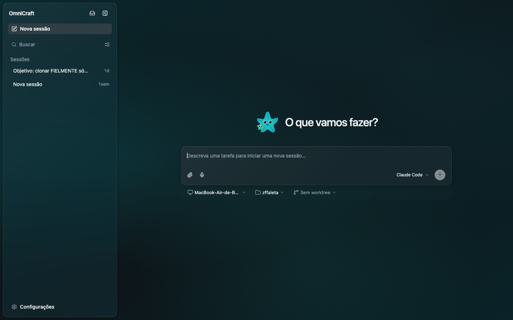

<div align="center">

#  OmniCraft

### O meta-harness open-source para todos os seus agentes de IA.

O **OmniCraft** é uma camada comum de orquestração sobre Claude Code, Codex,
Cursor, OpenCode, Hermes, Pi e os agentes que você mesmo escreve. Troque ou
combine harnesses sem reescrever nada, aplique políticas e sandboxing, e
colabore em tempo real de qualquer dispositivo — terminal, navegador, celular
ou o app desktop nativo.

[](LICENSE)


</div>

<p align="center">
  
</p>

> **Sobre este fork.** Este é um fork em **português do Brasil** com identidade
> visual própria (marca **OmniCraft** e tema **turquesa**). O projeto original
> chamava-se *Omnigent*; aqui a interface, o CLI e a documentação foram
> traduzidos e re-tematizados. Veja [o que muda neste fork](#-o-que-muda-neste-fork).

---

## Índice

- [Por que OmniCraft?](#por-que-omnicraft)
- [Início rápido](#início-rápido)
  - [1. Instalar](#1-instalar)
  - [2. Iniciar seu primeiro agente](#2-iniciar-seu-primeiro-agente)
  - [3. Escolher e trocar modelos](#3-escolher-e-trocar-modelos)
  - [4. Implantar um servidor (e usar do celular 📱)](#4-implantar-um-servidor-e-usar-do-celular-)
  - [5. Colaborar com seu time](#5-colaborar-com-seu-time)
  - [6. Governar seus agentes com políticas](#6-governar-seus-agentes-com-políticas)
- [Escreva seu próprio agente](#escreva-seu-próprio-agente)
- [O que muda neste fork](#-o-que-muda-neste-fork)
- [Contribuindo](#contribuindo)
- [Licença](#licença)

---

## Por que OmniCraft?

O OmniCraft permite que você:

- **📱 Trabalhe com agentes de qualquer dispositivo, inclusive o celular.**
  As sessões acompanham você: comece no terminal, continue no navegador,
  retome no celular. Mensagens, sub-agentes, terminais e arquivos ficam
  sincronizados.

- **🤖 Supervisione vários agentes ao mesmo tempo.** Misture Claude Code,
  Codex, Cursor, OpenCode, Hermes, Pi e agentes customizados (definidos em
  YAML) na mesma sessão. Peça a um agente para revisar o trabalho de outro, ou
  divida uma tarefa entre agentes bons em coisas diferentes.

- **🔌 Use qualquer modelo.** Uma chave de API própria, uma assinatura
  Claude/ChatGPT, ou qualquer gateway compatível. Todos de primeira classe.

- **🤝 Colabore.** Compartilhe uma sessão para que colegas conversem com seu
  agente e o vejam trabalhando ao vivo, co-dirijam na sua máquina, ou
  bifurquem (fork) a conversa para continuar por conta própria.

- **☁️ Rode agentes em sandboxes na nuvem.** Sem depender do notebook: execute
  sessões em sandboxes descartáveis de [Modal](https://modal.com),
  [Daytona](https://www.daytona.io), [Islo](https://islo.dev),
  [E2B](https://e2b.dev),
  [CoreWeave](https://docs.coreweave.com/products/sandboxes),
  [Kubernetes](https://kubernetes.io),
  [OpenShell](https://github.com/NVIDIA/OpenShell),
  [Boxlite](https://github.com/boxlite-ai/boxlite) ou
  [Databricks](https://www.databricks.com), lançados pelo CLI ou provisionados
  pelo servidor a cada sessão (*hosts gerenciados*).

- **🛡️ Governe seus agentes.** Crie
  [políticas](#6-governar-seus-agentes-com-políticas) para pausar e pedir sua
  aprovação antes de ações arriscadas, limitar gastos, ou restringir quais
  ferramentas um agente alcança. Elas se aplicam ao servidor inteiro, a um
  agente, ou a um único chat.

---

## Início rápido

### 1. Instalar

O OmniCraft precisa de **Python 3.12+**, **`uv`** e **`git`**. Como este é um
fork, instale direto do repositório:

```bash
# Instala o CLI (comandos `omnicraft` e o atalho `omni`) a partir do fork
uv tool install --python 3.12 git+https://github.com/editzffaleta/OmniCraft.git
```

<details>
<summary>Prefere clonar e instalar em modo editável (para desenvolver)?</summary>

```bash
git clone https://github.com/editzffaleta/OmniCraft.git
cd OmniCraft
uv tool install --force --editable .
```

Em modo editável, mudanças no código do repositório passam a valer sem
reinstalar. Veja o [CONTRIBUTING.md](CONTRIBUTING.md) para o fluxo completo.

</details>

<details>
<summary>Ferramentas e pré-requisitos</summary>

- **`uv`** (obrigatório). https://docs.astral.sh/uv/getting-started/installation/
- **`git`** (obrigatório).
- **Node.js 22 LTS ou mais novo** com **`npm`**, para os harnesses de código
  instalados via npm (Claude, Codex, OpenCode, Pi). O `omnicraft run` instala
  o CLI do harness que você escolher.
- **`tmux`**, exigido pelos wrappers nativos de terminal `omnicraft <harness>`
  (`claude`, `codex`, `cursor`, `hermes`, `kiro`, `pi`)
  (`brew install tmux` / `apt install tmux`).
- **`bubblewrap`** (`bwrap`), **somente Linux**. Os wrappers nativos e o
  harness `pi` isolam cada terminal num sandbox `bwrap`; no Linux essa
  isolação é obrigatória (`apt install bubblewrap`). O macOS usa o sandbox
  `seatbelt` embutido e não precisa de nada extra.
- **Databricks** (opcional). Para usar um workspace Databricks como provedor
  de modelo, instale com o extra `databricks`:
  `uv tool install "git+https://github.com/editzffaleta/OmniCraft.git#egg=omnicraft[databricks]"`.

</details>

<details>
<summary>Atualizando o fork</summary>

Este fork **não é publicado em nenhum índice público** (PyPI etc.) — por
segurança, o auto-update não resolve pacotes de índices públicos. Para
atualizar, puxe do git e reinstale:

```bash
# instalação editável (clone):
git pull

# instalação via git URL:
uv tool install --reinstall git+https://github.com/editzffaleta/OmniCraft.git
```

</details>

### 2. Iniciar seu primeiro agente

`omnicraft` escolhe um modelo com você e inicia uma sessão no seu terminal.
Ele também sobe uma web UI local em `http://localhost:6767` que mostra a mesma
sessão no navegador, ou num celular na sua rede (passo 4). O app desktop
envolve essa mesma UI numa janela nativa e adiciona notificações do sistema
(com som configurável) e um badge no dock.

> [!NOTE]
> A instalação coloca dois nomes para o mesmo CLI no seu PATH: `omnicraft` e o
> mais curto `omni`. São intercambiáveis.

> [!TIP]
> Na primeira execução, o OmniCraft aproveita credenciais de modelo já
> presentes no seu ambiente (uma `ANTHROPIC_API_KEY` / `OPENAI_API_KEY`, ou um
> CLI `claude` / `codex` já logado) e oferece uma como padrão.

```bash
omnicraft
```

Ou lance um runtime de agente específico:

```bash
omnicraft claude      # Claude Code, numa sessão que seu time pode entrar
omnicraft codex       # Codex
omnicraft cursor      # Cursor
omnicraft opencode    # OpenCode
omnicraft hermes      # Hermes Agent (Nous Research)
omnicraft pi          # Pi
```

#### 🐙 Polly e 🟠🔵 Debby

Dois agentes de exemplo acompanham o repositório e são ótimas primeiras
sessões:

```bash
omnicraft run examples/polly/
omnicraft run examples/debby/
```

**🐙 Polly** é uma orquestradora multi-agente de código que não escreve código
sozinha. Ela é a tech lead: planeja, delega o trabalho a sub-agentes de código
(Claude Code, Codex ou Pi) em worktrees git paralelos, e depois roteia cada
diff para um revisor de um fornecedor diferente daquele que escreveu. Você faz
o merge.

**🟠🔵 Debby** é uma parceira de brainstorming com duas cabeças, uma Claude e
uma GPT. Toda pergunta vai para ambas, e ela dispõe as duas respostas lado a
lado. Digite `/debate` e as cabeças criticam uma à outra por algumas rodadas
antes de convergir. (Precisa de uma credencial Claude e uma OpenAI; veja o
passo 3.)

**Prefere o navegador?** Suba um servidor e registre sua máquina como host:

```bash
omnicraft server start   # sobe o servidor local e a web UI em background
omnicraft host           # (outro terminal) registra esta máquina como host
```

Na web UI, clique em **Nova sessão**, escolha sua máquina, e vá. Confira o
status com `omnicraft server status`; pare tudo com `omnicraft stop`.

### 3. Escolher e trocar modelos

```bash
omnicraft setup
```

Adicione uma credencial, defina um padrão, ou remova uma — agrupadas por
agente. O OmniCraft trabalha com quatro tipos de credenciais:

| | Tipo | O que é |
|---|---|---|
| 🔑 | **Chave de API** | Uma chave própria de fornecedor: Anthropic, OpenAI e similares |
| 🎟️ | **Assinatura** | Um plano Claude Pro/Max ou ChatGPT, via os CLIs oficiais `claude` / `codex` |
| 🌐 | **Gateway** | Qualquer `base_url` + chave compatível com OpenAI ou Anthropic (OpenRouter, LiteLLM, Ollama, vLLM, Azure) |
| 🧱 | **Databricks** | Um perfil de workspace Databricks (requer o extra `databricks`) |

Os padrões são por agente, então um padrão Claude e um padrão Codex coexistem.
Você também pode trocar de modelo no meio de uma sessão com o comando `/model`.

<details>
<summary>Base URLs de gateway (OpenRouter, Ollama)</summary>

Ao adicionar uma credencial **Gateway**, o `omnicraft setup` pede uma base URL
e uma chave. A base URL depende de qual agente você aponta:

| Provedor | Para | Base URL | Chave |
|---|---|---|---|
| **OpenRouter** | Claude Code | `https://openrouter.ai/api` | sua chave OpenRouter (`sk-or-…`) |
| **OpenRouter** | Codex / agentes OpenAI | `https://openrouter.ai/api/v1` | sua chave OpenRouter (`sk-or-…`) |
| **Ollama** (local) | Codex / agentes OpenAI | `http://localhost:11434/v1` | qualquer valor (o Ollama ignora) |

Para o Claude Code, aponte para o endpoint compatível-com-Anthropic do
OpenRouter (`…/api`, **não** `…/api/v1`). Para o Codex e o harness de agentes
OpenAI, use o `…/api/v1` compatível-com-OpenAI.

</details>

### 4. Implantar um servidor (e usar do celular 📱)

Rode o OmniCraft num servidor com URL estável
([`deploy/README.md`](deploy/README.md) é o guia completo) e suas sessões
ficam acessíveis de qualquer lugar, inclusive do celular. A web UI é feita
para mobile, então você tem o mesmo chat, sub-agentes, terminais e arquivos,
em sincronia com o notebook.

Um `docker compose up` roda o servidor em qualquer host que você tenha (um
VPS, um servidor caseiro); **Render** e **Railway** implantam com um clique;
**Fly.io**, **Hugging Face Spaces**, **Modal**, **Cloudflare** (serverless,
escala-a-zero) e **Databricks Apps** também são cobertos — e um **quick tunnel
do Cloudflare** (público) ou **Tailscale** (privado) alcança um servidor
rodando no seu próprio notebook sem deploy. O cardápio completo de destinos,
as opções de banco de dados e a configuração de sandbox estão em
[`deploy/README.md`](deploy/README.md).

Com o servidor no ar, faça login e registre seu notebook como host:

```bash
omnicraft login https://seu-host    # login uma vez; run / attach / host reusam o token
omnicraft host  https://seu-host    # novas sessões agora podem rodar nesta máquina
```

> [!TIP]
> Na sua própria rede você não precisa de deploy. Abra o endereço LAN da sua
> máquina no celular (ex.: `http://192.168.x.x:6767`).

### 5. Colaborar com seu time

O OmniCraft suporta **contas multiusuário**, controladas por uma variável de
ambiente:

```bash
OMNICRAFT_AUTH_ENABLED=1 omnicraft server start
```

O **deploy Docker no [passo 4](#4-implantar-um-servidor-e-usar-do-celular-)
já liga isso para você** (`OMNICRAFT_AUTH_ENABLED` tem padrão `1` lá).

#### Convide seus colegas

Abra a web UI (`http://localhost:6767` localmente, ou a URL do seu host) e
entre como `admin`; a primeira execução imprime a senha e a salva localmente.
Depois abra **Admin → Membros → Convidar** para criar um link de convite de
uso único, sem servidor de e-mail. Envie; seu colega abre, define uma senha, e
está dentro. O cadastro é somente por convite.

#### Programem juntos

- **Compartilhe uma sessão ao vivo.** Clique em **Compartilhar** na web UI e
  envie o link; colegas veem seu agente trabalhando e conversam com ele em
  tempo real.
- **Co-dirija.** Um colega se co-anexa à sua sessão em execução; as mensagens
  dele executam na **sua** máquina. Ótimo para pareamento ou passar o teclado
  a um especialista no meio de uma investigação.

  ```bash
  omnicraft attach <session_id>
  ```

- **Bifurque (fork).** Clone uma conversa para a sua máquina e continue de
  forma independente a partir do ponto do fork.

  ```bash
  omnicraft run --fork <session_id>
  ```

> [!TIP]
> Quer que seu time entre com os logins que já têm (**Google, GitHub, Okta,
> Microsoft**)? Configure `OMNICRAFT_OIDC_ISSUER` mais um client ID e secret no
> servidor implantado e reinicie. O passo a passo completo está em
> [`deploy/README.md`](deploy/README.md).

### 6. Governar seus agentes com políticas

**Políticas** decidem o que um agente pode fazer: rodar comandos de shell,
editar arquivos, gastar tokens. Elas verificam cada ação e ou permitem,
bloqueiam, ou pausam para perguntar a você primeiro.

- **Na web UI**: abra o painel de informações de uma sessão para navegar pelas
  políticas disponíveis e ligá-las/desligá-las.
- **No chat**: peça. *"Adicione uma política que me pergunte antes de rodar
  comandos de shell."* O agente configura para você.

Quer padrões que se apliquem a todos, ou a um agente específico? Defina-os na
config do servidor ou no YAML de um agente:

```yaml
policies:
  approve_shell:
    type: function
    handler: omnicraft.policies.builtins.safety.ask_on_os_tools   # perguntar antes de shell / escrita de arquivo
  cap_calls:
    type: function
    handler: omnicraft.policies.builtins.safety.max_tool_calls_per_session
    factory_params:
      limit: 50                    # limita quantas ferramentas uma sessão pode chamar
  budget:
    type: function
    handler: omnicraft.policies.builtins.cost.cost_budget
    factory_params:
      max_cost_usd: 5.00           # teto rígido de gasto...
      ask_thresholds_usd: [3.00]   # ...com um aviso leve no caminho
```

As políticas se empilham em três níveis, **servidor inteiro** (admin),
**por agente** (dev) e **por sessão** (você), com as regras mais estritas da
sessão verificadas primeiro. Tetos de gasto e limites de acesso vêm como
builtins.

Veja o [guia de políticas](docs/POLICIES.md) para o catálogo completo e o
modelo de confiança.

---

## Escreva seu próprio agente

Um agente é um arquivo YAML curto: seu prompt, suas ferramentas — funções
Python locais, servidores MCP, e sub-agentes a quem um supervisor pode
delegar. Você não precisa escrever à mão: agentes podem construir agentes,
então descreva o agente que você quer em qualquer chat do OmniCraft e ele
escreve o arquivo para você.

```yaml
name: meu_agente
prompt: Você é um analista de dados prestativo.

executor:
  harness: claude-sdk          # ou: claude-native, codex, codex-native, cursor,
                               # cursor-native, hermes, hermes-native, opencode,
                               # pi, pi-native, openai-agents

tools:
  # Uma função Python local (schema gerado automaticamente pela assinatura)
  word_count:
    type: function
    callable: mypackage.mymodule.word_count

  # Ferramentas de um servidor MCP (um comando local, ou uma URL remota)
  docs:
    type: mcp
    url: https://example.com/mcp

  # Um sub-agente a quem o supervisor pode delegar
  researcher:
    type: agent
    prompt: Pesquise informações relevantes e resuma.
    tools:
      word_count: inherit
```

Rode com:

```bash
omnicraft run caminho/para/meu_agente.yaml
```

O mesmo arquivo pode declarar sub-agentes e revisores. Para um exemplo mais
completo, veja a Polly em [`examples/polly/`](examples/polly/), e a
[especificação de Agent YAML](docs/AGENT_YAML_SPEC.md) para o schema completo.

---

## 🎨 O que muda neste fork

Este fork foi totalmente re-tematizado e traduzido a partir do projeto
original (*Omnigent*):

- **Marca OmniCraft** — nome, banner ASCII do CLI, título das janelas,
  ícone do app macOS e mascote (a estrela-do-mar Otto) atualizados.
- **Tema turquesa** — a cor de marca rosa (`#df3c85`) deu lugar ao
  turquesa (`#0fb5bd`) em toda a interface (web e CLI), incluindo o fundo
  escuro com brilho teal.
- **Interface 100% em português do Brasil** — web UI, telas de setup, REPL e
  mensagens do CLI.
- **Comando `omnicraft`** (mais o atalho `omni`) no lugar do binário antigo.
- **Segurança**: o auto-update foi desacoplado de índices públicos para evitar
  *dependency confusion* — atualizações vêm apenas deste repositório git.

---

## Contribuindo

Contribuições são bem-vindas. Veja o [CONTRIBUTING.md](CONTRIBUTING.md) para
configurar seu ambiente, rodar os checks e abrir um pull request.

Vai adicionar ou mudar o suporte a um harness (Claude, Codex, Cursor,
OpenCode, Hermes, Pi, ...)? Rode o
[banco de testes de harness](tests/harness_bench) para checar a matriz de
capacidades dele contra o comportamento observado.

A política de segurança e como reportar vulnerabilidades estão em
[SECURITY.md](SECURITY.md).

---

## Licença

Distribuído sob a **Licença Apache 2.0** — veja [LICENSE](LICENSE) (texto
oficial, em inglês) e [LICENSE.pt-BR.md](LICENSE.pt-BR.md) (tradução de
referência, não-oficial).
