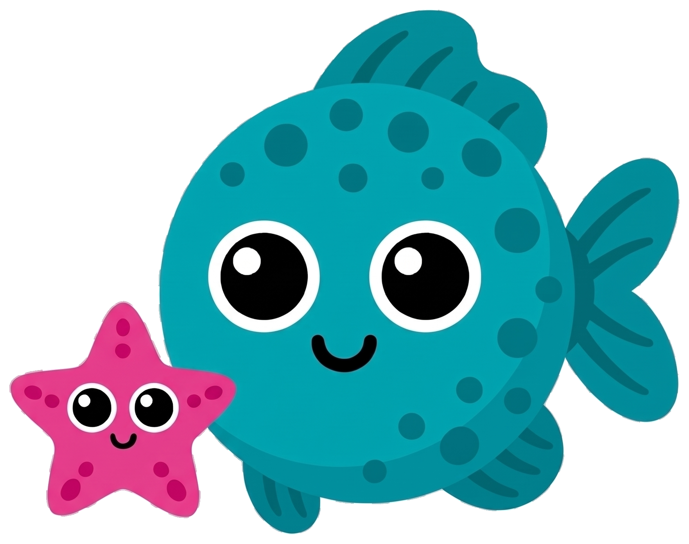
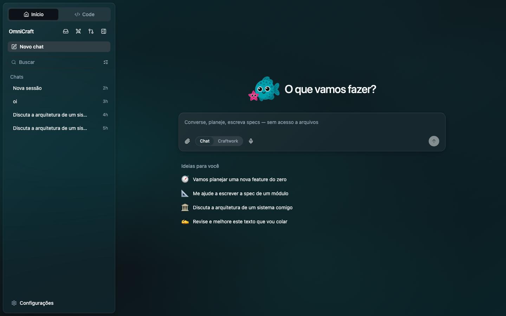
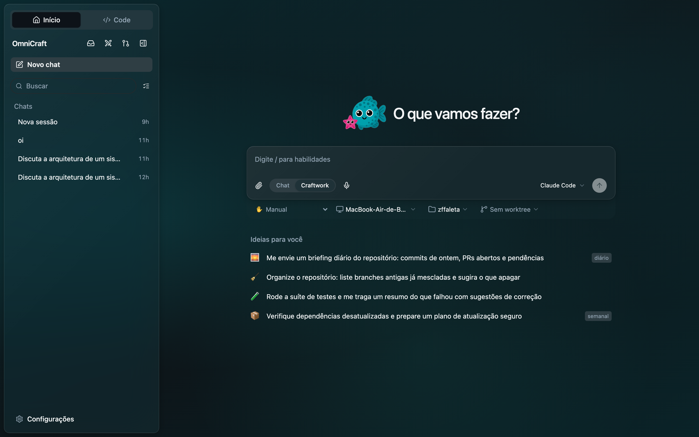
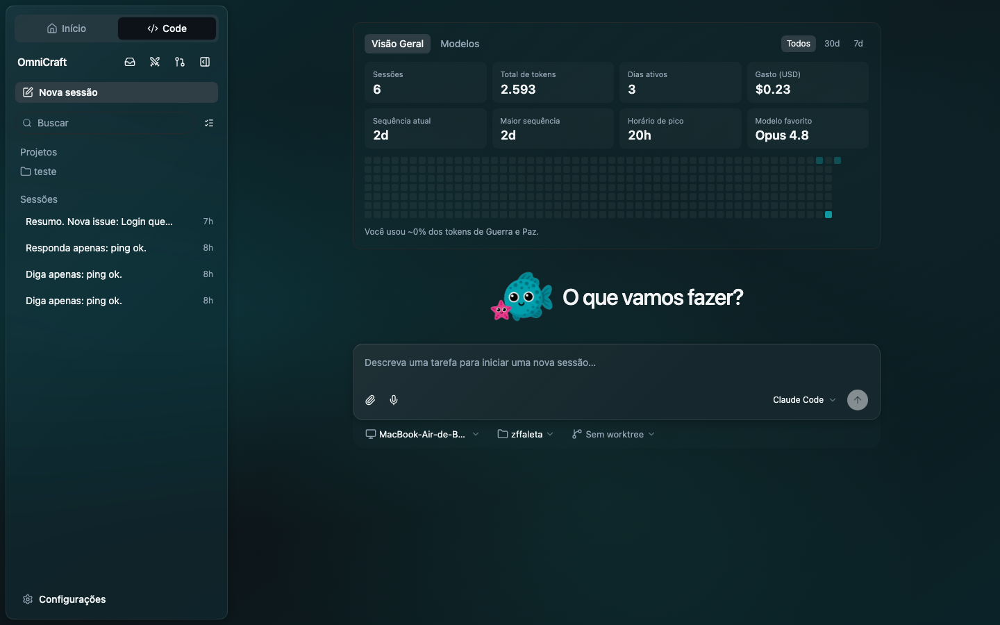
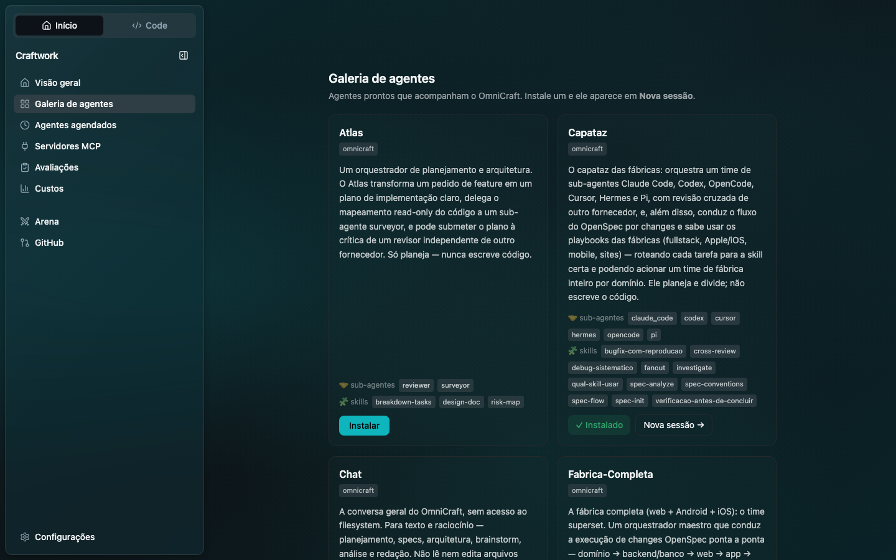
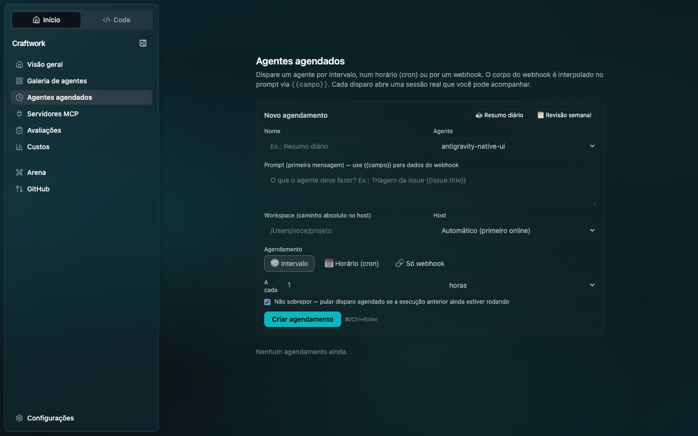
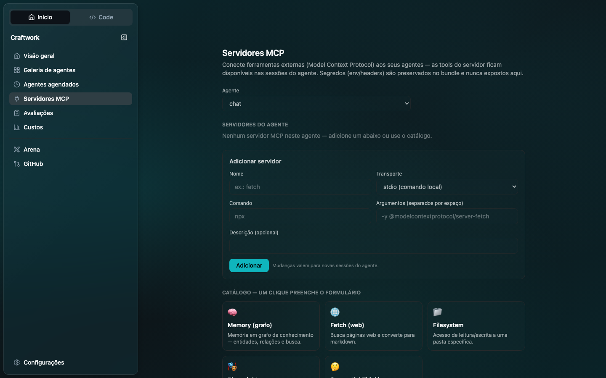
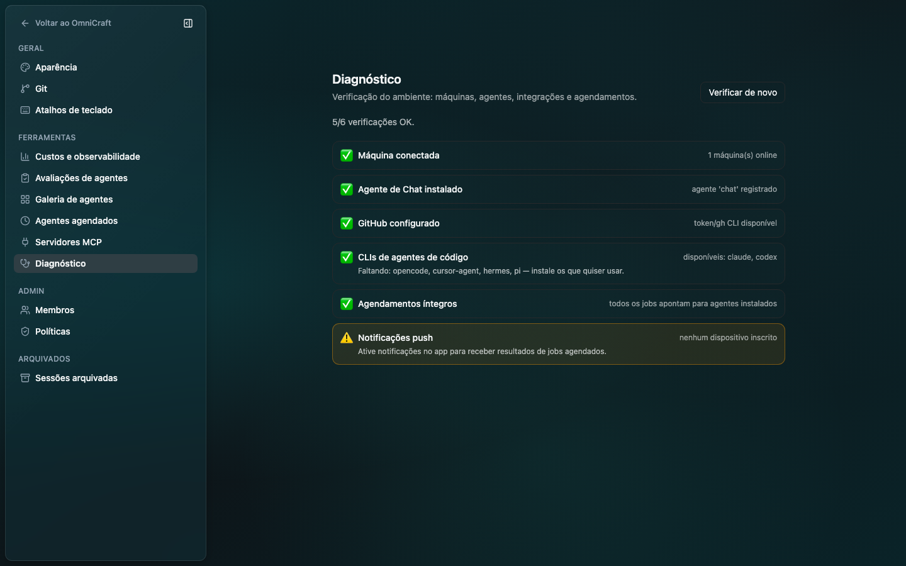
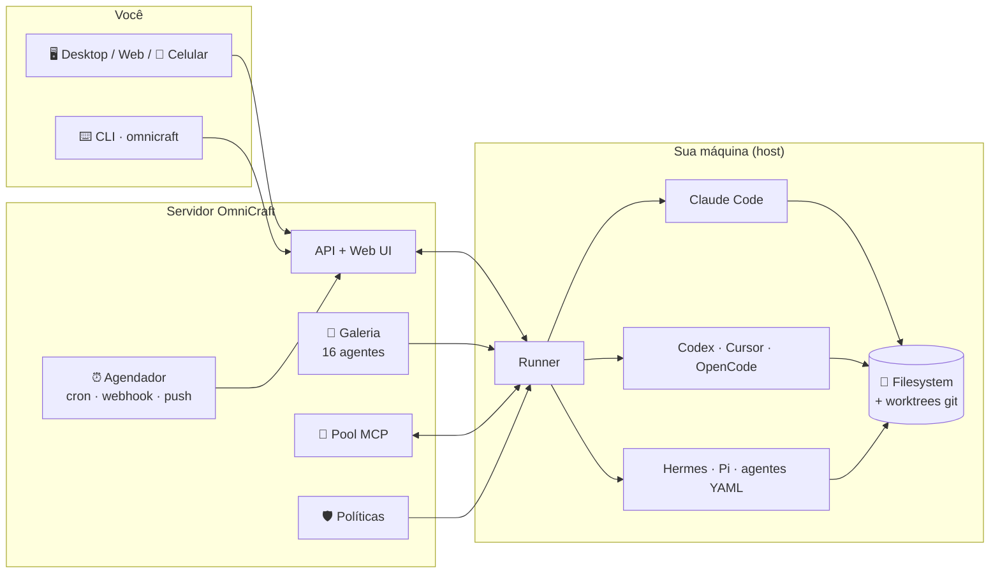

<div align="center">

#  OmniCraft

### Converse. Codifique. Automatize. Um só lugar para todos os seus agentes de IA.

O **OmniCraft** é um ambiente de trabalho completo para agentes: um **Chat**
seguro para pensar (sem acesso aos seus arquivos), um **Code** para executar
(Claude Code, Codex, Cursor, OpenCode, Hermes, Pi e times de agentes em YAML),
e um **Craftwork** para automatizar — agende tarefas, dispare por webhook e
receba o resultado como notificação. Do terminal, do navegador, do celular ou
do app desktop nativo.

[](LICENSE)


</div>

<p align="center">
  
</p>

> **Sobre este fork.** Fork em **português do Brasil** do projeto *Omnigent*,
> com identidade própria (marca **OmniCraft**, tema turquesa 🐟) e um conjunto
> grande de funcionalidades novas — as três superfícies Início/Code/Craftwork,
> agendamento com entrega por push, gestão de servidores MCP, galeria com
> times de agentes, memória local, diagnóstico e mais. Veja
> [o que este fork adiciona](#-o-que-este-fork-adiciona).

---

## Índice

- [As três superfícies](#%EF%B8%8F-as-três-superfícies)
- [Início rápido](#-início-rápido)
- [Galeria de agentes: times prontos](#-galeria-de-agentes-times-prontos)
- [Automação: agende, dispare, receba](#-automação-agende-dispare-receba)
- [Servidores MCP](#-servidores-mcp)
- [Observabilidade e diagnóstico](#-observabilidade-e-diagnóstico)
- [Governança: políticas e sandbox](#%EF%B8%8F-governança-políticas-e-sandbox)
- [Arquitetura em um diagrama](#-arquitetura-em-um-diagrama)
- [Servidor próprio, celular e colaboração](#-servidor-próprio-celular-e-colaboração-)
- [Escreva seu próprio agente](#%EF%B8%8F-escreva-seu-próprio-agente)
- [O que este fork adiciona](#-o-que-este-fork-adiciona)
- [Qualidade](#-qualidade)
- [Contribuindo](#contribuindo) · [Licença](#licença)

---

## 🗂️ As três superfícies

O OmniCraft organiza o trabalho com agentes e vai além:

| | **💬 Chat** | **🛠️ Craftwork** | **`</>` Code** |
|---|---|---|---|
| **Para quê** | Pensar: planejar, escrever specs, discutir arquitetura, revisar textos | Automatizar: tarefas agênticas numa pasta, agora ou agendadas | Executar: sessões de código com filesystem, worktrees e terminal |
| **Acesso a arquivos** | **Nenhum — garantido por arquitetura**, não por promessa | Sim, na pasta escolhida | Sim, completo |
| **Memória** | Longo prazo, local, por projeto | — | — |
| **Extra** | Painel de **Artifacts** com "→ Code" | Frequência **Manual/Diário/Semanal** vira job real | Dashboard pessoal + "Discutir no Chat" |

### 💬 Chat — pense sem risco

A aba **Início** é a conversa geral do OmniCraft. O agente de Chat **não
recebe nenhuma ferramenta de filesystem** (o servidor rejeita qualquer bundle
"chat" que tente declarar uma) — então cole specs, discuta arquitetura e
refine ideias sabendo que nada toca seus arquivos.

- **🧠 Memória local de longo prazo** — o Chat lembra fatos entre conversas,
  em arquivo local, **sem chave de API nem serviço externo**, com bancos
  separados por projeto.
- **📦 Painel de Artifacts** — os blocos de código e documentos que o
  assistente gera ficam colecionados num painel lateral, com copiar, baixar e
  **"→ Code"**: um clique leva o plano pronto para o composer de execução.
- **🐟 E sim, o mascote nada de verdade** enquanto você pensa.

### 🛠️ Craftwork — automatize no mesmo composer

O toggle **Chat / Craftwork** transforma o composer no lugar (sem trocar de
tela, idêntico ao Cowork): escolha a pasta, o agente, e uma **frequência** —
`Manual` executa agora; `Diário / Dias úteis / Semanal` **cria um job real no
agendador** com um clique, no seu fuso horário.

<p align="center">
  
</p>

### `</>` Code — execute com contexto

A aba **Code** é o composer clássico de sessões com filesystem — máquina,
pasta de trabalho, worktree git — mais um **dashboard pessoal**: sessões,
tokens, dias ativos, sequência (streak), horário de pico, modelo favorito e um
heatmap de atividade estilo GitHub. Ao terminar, **"Discutir no Chat"** leva o
resultado de volta para a mesa de planejamento.

<p align="center">
  
</p>

---

## 🚀 Início rápido

```bash
# 1. Instale o CLI (comandos `omnicraft` e o atalho `omni`)
uv tool install --python 3.12 git+https://github.com/Omni-Craft/OmniCraft.git

# 2. Configure um provedor de modelo (Anthropic, assinatura Claude, gateway…)
omnicraft setup

# 3. Suba o servidor local + web UI, e registre sua máquina como host
omnicraft server start
omnicraft host        # em outro terminal
```

Abra a web UI, escolha **Início** para conversar ou **Code** para executar —
ou rode um agente direto no terminal:

```bash
omnicraft run examples/fucho/     # orquestradora multi-agente de código
omnicraft claude                  # Claude Code embrulhado com sessões/políticas
```

<details>
<summary><b>Pré-requisitos e instalação para desenvolvimento</b></summary>

- **`git`** (obrigatório) e **Python 3.12** (o `uv` resolve para você).
- **Node.js 22 LTS+** com `npm`, para os harnesses instalados via npm
  (Claude, Codex, OpenCode, Pi) e para servidores MCP via `npx`.
- **`tmux`**, exigido pelos wrappers nativos de terminal
  (`omnicraft claude|codex|cursor|hermes|kiro|pi`) —
  `brew install tmux` / `apt install tmux`.

```bash
# Modo editável (para desenvolver no fork)
git clone https://github.com/Omni-Craft/OmniCraft.git
cd OmniCraft
uv tool install --force --editable .
```

- **Databricks** (opcional): instale com o extra `databricks` para usar um
  workspace como provedor de modelo.

</details>

---

## 🤖 Galeria de agentes: times prontos

**10 agentes instaláveis com um clique** — de assistentes simples a
orquestradores multi-agente que coordenam times de especialistas, somando
**20 sub-agentes** e **20 skills**:

<p align="center">
  
</p>

| Agente | O que é | Sub-agentes | Skills |
|---|---|---:|---:|
| **fucho** | Orquestradora multi-agente de código (Claude Code · Codex · Cursor · OpenCode · Hermes · Pi) com revisão de outro fornecedor | 6 | 3 |
| **maestro** | Testes/QA: escreve testes, delega execução, revisa o design da suíte | 2 | 3 |
| **atlas** | Planejamento/arquitetura: produz planos, nunca escreve código | 2 | 3 |
| **polyglot** | Localização/i18n com revisão de fluência cross-vendor | 2 | 3 |
| **sculptor** | Refatoração segura: mapeia o raio de impacto antes, verifica depois | 2 | 3 |
| **scribe** | Documentação: release notes, READMEs, guias de migração | 2 | 3 |
| **sentinel** | Auditoria de segurança — só reporta, nunca corrige sozinho | 2 | 1 |
| **lilo** | Debate entre dois modelos de fornecedores diferentes | 2 | 1 |
| **remy** | Assistente com memória de longo prazo (Hindsight) | — | — |
| **chat** | A conversa geral sem filesystem que alimenta a aba Início | — | — |

Nos orquestradores, a **revisão é sempre de um fornecedor diferente** do
implementador — o PR de um Claude é julgado por um Codex/Cursor/Pi, e
vice-versa. Digite **`/`** no composer para navegar pelas skills do agente
selecionado.

---

## ⏰ Automação: agende, dispare, receba

<p align="center">
  
</p>

Um **job agendado** liga um agente + prompt + pasta a um gatilho:

- **🕒 Intervalo ou horário exato** — "a cada 6 horas" ou cron de 5 campos
  (`0 9 * * 1-5`) **no seu fuso IANA**, com templates de um clique
  (☕ Resumo diário, 📋 Revisão semanal) e proteção contra disparo duplo no
  horário de verão.
- **🔗 Webhook público por token** — o GitHub/Linear/Stripe chama a URL e o
  corpo do POST é interpolado no prompt via `{{issue.title}}`; comparação de
  token em tempo constante e resposta opaca.
- **📬 O resultado volta para você** — ao terminar, a resposta final do agente
  chega como **notificação push** clicável; se o job falhar 3 vezes seguidas,
  você também fica sabendo.
- **🧯 À prova de acidentes** — sem sobreposição de execuções, retry curto
  quando a máquina está offline, validação estrita (cron impossível,
  intervalo inválido e fuso errado retornam `400`, não um loop infinito), e
  escrita atômica do estado.

---

## 🔌 Servidores MCP

Conecte ferramentas externas (Model Context Protocol) a **qualquer agente da
galeria** — stdio ou HTTP — com um **catálogo de um clique** (Memory graph,
Fetch, Filesystem, Playwright, Sequential Thinking) e um botão **Testar** que
disca o servidor de verdade e lista as tools que ele expõe:

<p align="center">
  
</p>

Segredos (`env`/`headers`) ficam apenas no bundle do agente — a API nunca os
aceita nem os devolve.

---

## 📊 Observabilidade e diagnóstico

- **Custos ao vivo** — gasto por dia, por modelo e por sessão, com alerta de
  orçamento.
- **Avaliações/regressão** — suites de testes para agentes com comparação
  entre execuções.
- **Diagnóstico** — seis verificações do ambiente com dicas acionáveis:
  máquina conectada, agente de Chat, GitHub, CLIs de código no PATH,
  integridade dos agendamentos e inscrição de push. Nunca mais depurar
  "não funciona" às cegas:

<p align="center">
  
</p>

---

## 🛡️ Governança: políticas e sandbox

Cada agente roda sob **políticas** declarativas (23 no catálogo, em pt-BR):
raio de explosão de comandos git, limites de custo, aprovação de pushes,
guarda de propósito de sub-agentes, escopo de diretório e mais — com **editor
visual e simulação** contra sessões reais antes de aplicar.

```yaml
policies:
  approve_shell:
    type: function
    handler: omnicraft.policies.builtins.safety.ask_on_os_tools   # perguntar antes de shell / escrita
  budget:
    type: function
    handler: omnicraft.policies.builtins.cost.cost_budget
    factory_params:
      max_cost_usd: 5.00           # teto rígido de gasto...
      ask_thresholds_usd: [3.00]   # ...com um aviso leve no caminho
```

As políticas se empilham em três níveis — **servidor** (admin), **agente**
(dev) e **sessão** (você) — sempre vencendo a mais estrita. Agentes que
revisam código não confiável rodam **sandboxados por padrão**
(`bwrap`/`seatbelt`), e o nome `chat` é **reservado no servidor** para specs
sem filesystem: um bundle impostor com `os_env` é rejeitado com `400`.

---

## 🧬 Arquitetura em um diagrama



O servidor orquestra; o **runner** executa na sua máquina (ou num sandbox
gerenciado). A aba Chat conversa com um agente **sem** a ponta `FS` — por
construção, não por configuração.

---

## 🌐 Servidor próprio, celular e colaboração 📱

Rode o OmniCraft num servidor com URL estável e as sessões acompanham você —
a web UI é feita para mobile, com o mesmo chat, sub-agentes, terminais e
arquivos em sincronia com o notebook.

```bash
omnicraft login https://seu-host    # login uma vez; run / attach / host reusam o token
omnicraft host                      # registra o notebook como host do servidor
```

- **Compartilhe uma sessão ao vivo** — clique em **Compartilhar** e envie o
  link; colegas veem o agente trabalhando e conversam com ele em tempo real.
- **Co-dirija** — `omnicraft attach <session_id>` co-anexa um colega à sua
  sessão; as mensagens dele executam na **sua** máquina.
- **Bifurque** — `omnicraft run --fork <session_id>` clona a conversa para
  outra máquina e segue de forma independente.
- **SSO** — Google, GitHub, Okta e Microsoft via `OMNICRAFT_OIDC_ISSUER`.

`docker compose up` sobe em qualquer VPS; **Render** e **Railway** implantam
com um clique; **Fly.io**, **Hugging Face Spaces**, **Modal**, **Cloudflare**
e **Databricks Apps** também são cobertos — e um quick tunnel do Cloudflare ou
**Tailscale** alcança um servidor no seu próprio notebook sem deploy. Guia
completo em [`deploy/README.md`](deploy/README.md).

---

## ✍️ Escreva seu próprio agente

Um agente é uma pasta com um `config.yaml` — prompt, harness, ferramentas,
sub-agentes, skills, políticas e MCPs:

```yaml
spec_version: 1
name: meu-agente
description: >-
  Um revisor de PRs que lê o diff e comenta em pt-BR.
executor:
  type: omnicraft
  config:
    harness: claude-sdk
os_env:
  type: caller_process
  cwd: .
guardrails:
  policies:
    blast_radius:
      type: function
      on: [tool_call]
      function:
        path: omnicraft.inner.nessie.policies.blast_radius
prompt: |
  Você é um revisor de PRs criterioso...
```

```bash
omnicraft run meu-agente/
```

Os 10 agentes de [`examples/`](examples/) são o melhor material de estudo — do
`chat` minimalista à `fucho` (orquestradora completa com guardrails, spawn e
revisão cruzada entre fornecedores). Especificação completa em
[`docs/AGENT_YAML_SPEC.md`](docs/AGENT_YAML_SPEC.md).

---

## 🍴 O que este fork adiciona

Além da tradução completa (UI, CLI, políticas e docs em **pt-BR**) e da
identidade OmniCraft, este fork traz um conjunto grande de funcionalidades
que não existem no upstream:

| Área | Novidades |
|---|---|
| **Superfícies** | Abas **Início/Code** com históricos separados; **Chat sem filesystem** (garantia no servidor); **Craftwork** in-place estilo Cowork com frequência |
| **Chat** | Memória local por projeto (sem chave), painel de **Artifacts** com "→ Code", "Discutir no Chat" no caminho inverso, mascote nadando 🐟 |
| **Automação** | Agendador com cron+fuso+templates, **webhooks com templating** `{{...}}`, **resultado por push**, alerta de falhas, no-overlap, escopo por dono |
| **Agentes** | Galeria instalável com 10 agentes: a orquestradora **fucho**, maestro/atlas/polyglot/sculptor/scribe/sentinel, o **lilo** (debate cross-vendor), o **remy** (memória) e o chat |
| **MCP** | Página de gestão para agentes template, **catálogo de um clique**, **teste de conexão real** |
| **Cockpit** | Dashboard pessoal do Code (streaks, heatmap, modelo favorito), custos ao vivo, avaliações/regressão, **Diagnóstico** |
| **Integrações** | GitHub (issues/PRs → sessão semeada), menu **`/`** de skills, onboarding de primeiro uso |
| **Confiabilidade** | Auditoria completa em 4 frentes com **26 correções** — validação estrita do scheduler, escrita atômica dos stores, locks multi-processo, DST, tema claro |

---

## ✅ Qualidade

- Todas as funcionalidades novas foram **verificadas ao vivo** (E2E no
  navegador e via API) além de cobertas por testes unitários — incluindo casos
  como o disparo duplo de cron na transição real de horário de verão de
  2026-11-01 em `America/New_York`.
- Uma **auditoria multi-agente em 4 frentes** (backend, frontend, integração
  E2E, bundles) encontrou e corrigiu 26 problemas antes de você lê-los aqui.
- `pre-commit` (ruff, prettier, ktlint, swift-format) e a CI espelham as
  mesmas verificações.

```bash
# testes do servidor
uv run --with pytest --with pytest-asyncio python -m pytest tests/server -q

# frontend
cd web && npx tsc -b && npx vitest run
```

---

## Contribuindo

Issues e PRs são bem-vindos. Leia o [CONTRIBUTING.md](CONTRIBUTING.md) para o
fluxo completo (pre-commit, template de PR com demo em vídeo/imagem para
mudanças de UI) e o [`CLAUDE.md`](CLAUDE.md) se você for um agente de IA
trabalhando neste repositório — sim, este fork foi construído em parceria com
um. 🤝

## Licença

[Apache 2.0](LICENSE). Este projeto é um fork do **Omnigent** — todo o crédito
da fundação (runtime, harnesses, políticas, deploy) vai para o projeto
original; as funcionalidades listadas
[acima](#-o-que-este-fork-adiciona) são deste fork.

---

<div align="center">

Feito com 🐟 em português do Brasil.

*Se o mascote estiver nadando de costas, abra uma issue.*

</div>
