# OmniCraft Notch — camada visual do HUD

Front-end nativo (Swift + SwiftUI, macOS 14+) do HUD que ocupa a área da notch do
MacBook e mostra agentes de IA rodando. Duas fontes de dados, alternáveis no menu
de debug: **fixtures mockadas** (`MockFeed`, o modo de desenvolvimento) e o **feed
real** do servidor local do OmniCraft (`GET /v1/monitor/sessions`).

## Rodar

```bash
swift build
.build/debug/OmniCraftNotch
```

O app é um acessório (sem ícone no Dock, sem janela principal): aparece a ilha preta
**fundida com a notch** — colada no topo da tela, cobrindo a área do recorte, com o
conteúdo nas laterais da câmera (em Mac sem notch, flutua colada ao topo com
proporções de notch). Na barra de menus, o ícone ◎ abre o **menu de debug**
(cenário, modo de visibilidade, expandir/colapsar, encerrar).

Argumentos úteis para depurar/capturar estados:

```bash
.build/debug/OmniCraftNotch --cenario 8              # abre direto numa fixture (1–8)
.build/debug/OmniCraftNotch --cenario 6 --expandido  # força a ilha aberta
.build/debug/OmniCraftNotch --cenario 1 --colapsado  # força o pill (marca atenções como vistas)
.build/debug/OmniCraftNotch --live                   # liga direto no feed real
.build/debug/OmniCraftNotch --live -OmniCraftFeedBaseURL "http://127.0.0.1:7777"
                                                     # base URL só desta execução (não persiste)
```

## Feed real

- **Endpoint**: `GET <base>/v1/monitor/sessions`. Base configurável no menu de
  debug (persistida em `UserDefaults`, chave `OmniCraftFeedBaseURL`; default
  `http://127.0.0.1:6767`).
- **Polling**: 3 s com a ilha expandida, 10 s colapsada; um request por vez
  (trocar de estado/URL cancela o que está em voo). Falha entra em backoff
  1 → 2 → 5 → 15 s e retoma o ritmo normal ao reconectar.
- **Desconectado**: pill e ilha mostram "sem conexão com o OmniCraft" — nunca a
  última lista boa como se fosse o agora. O menu de debug mostra o status e o
  horário do `generated_at` do último feed.
- **Decodificação tolerante** (`FeedClient`): tudo opcional, campo desconhecido é
  ignorado e sessão malformada é pulada (`LossyArray`) sem derrubar o resto.
- **As quatro regras no `FeedMapper`**: barra de uso só com `usage.cost_usd` **e**
  `usage.budget.max_cost_usd` (o `usage.source` é `local_counter`, nunca cota do
  provedor); o teto é rotulado "orçamento do agente" (`budget.source ==
  agent_spec`); linha com `degraded` de status vira `desconhecido` (nunca some
  nem vira "ocioso"); `counts.partial == true` vira o `≥` do pill.
- `pending_elicitation` → card âmbar com o texto real; `pending_elicitations_count`
  alimenta o ‹ 1 de N › (o feed só traz o primeiro pedido; os demais aparecem como
  "detalhes ainda não carregados" — honestos, nunca inventados).

## Os três estados

| Estado | O que é |
|---|---|
| **Colapsado (pill)** | Cápsula com o resumo (`3 ativas · 1 aguardando`), ícone de status e chevron. `≥` prefixa contagens que são piso; "contagens indisponíveis" quando não deu para ler — nunca um número inventado. |
| **Expandido (ilha)** | Lista de sessões: título, estado (ícone + texto, nunca só cor), metadados (`runner · host · custo`) e gauge de uso. |
| **Atenção** | A sessão `aguardando você` sobe ao topo com moldura/fundo âmbar e o pedido inline com botões Aprovar (primário) / Aprovar tudo / Rejeitar — visuais: só logam e mudam estado local. Vários pedidos empilham com navegação ‹ 1 de N ›. |

Transição pill ↔ ilha com mola (`.spring(response: 0.35, dampingFraction: 0.8)`) e
fade; com **Reduce Motion** ligado vira fade puro (`easeOut 0.2s`). Auto-expande só
para atenção **nova** — colapsar manualmente marca as atuais como vistas e o HUD não
reabre sozinho para elas.

## Refinamentos de interação

- **Hover expande** (280 ms de intenção); sair do mouse recolhe **só** o que o hover
  abriu (nunca fecha o que veio de clique ou atenção nova, e não marca pedidos como
  vistos).
- **Linha de atividade por sessão**: ferramenta atual (`⚙ Bash · npm test`) e diff
  (`+58 −3`) quando conhecidos — nunca 0 inventado.
- **Fila global de pedidos**: atenções de TODAS as sessões empilham numa fila única
  com ‹ i de N ›; a sessão em destaque sai da lista para não duplicar.
- **"há Xs"** no header da ilha (feed real): idade do `generated_at`, atualizada a
  cada segundo.
- **Janelas de limite do provedor** (`5 h ▓▓ 52% · reseta em 2 h 05`): aqui a barra é
  legítima porque o denominador é REAL (a janela de rate-limit); janela ilegível
  mostra `—`, nunca barra inventada. Chega pelo campo tolerante `limit_windows` do
  feed (ausente = seção some).
- **Modo barra de menus**: segundo item 🔔 na barra abre a MESMA ilha como popover —
  para Mac sem notch e displays externos; o picker "Exibição" do debug esconde a
  notch quando quiser só a barra.
- **Utilidades a um clique** na base da ilha: servers locais (abrir/parar visuais,
  copiar URL de verdade), comandos salvos (copiar para o clipboard) e atalhos —
  ações destrutivas/externas só logam nesta etapa.

## Cenários do menu de debug

| # | Cenário | O que exercita |
|---|---|---|
| 1 | Três ativas, uma aguardando | Pill do enunciado + card de atenção com pedido de `git push` e auto-expand |
| 2 | Só ativas, sem atenção | Pill sem o "aguardando"; ilha sem card âmbar |
| 3 | Vazio | Pill some (ou fica mínimo, conforme o modo de visibilidade); estado vazio da ilha |
| 4 | Degradado (piso ≥) | Contagem como piso (`≥3 ativas`) e sessão com estado `desconhecido` (metadados `—`) |
| 5 | Contagens ilegíveis | Estado neutro de incerteza: "contagens indisponíveis", sem número inventado |
| 6 | Uso (com e sem teto) | Gasto **e** teto → barra fina verde→âmbar→vermelho; gasto **sem** teto → só o valor em texto; sem dado → `—` |
| 7 | Falha | Sessão em `falhou` (ícone + texto vermelhos) ao lado de uma saudável |
| 8 | Múltiplos pedidos | Três atenções empilhadas com navegação ‹ 1 de 3 › |

## Modos de visibilidade do pill

- **Sempre visível** · **Esconder quando ocioso** · **Só quando há atenção** —
  alternáveis no menu de debug; afetam apenas o visual.

## Screenshots

| Estado | Imagem |
|---|---|
| Pill colapsado (cenário 1) | 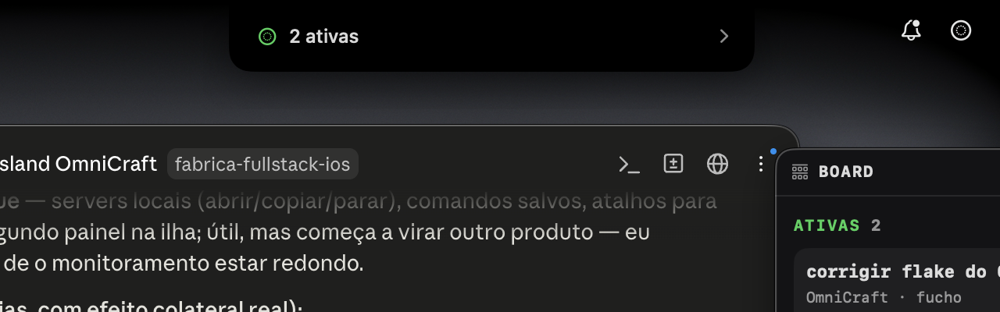 |
| Ilha expandida com atenção (cenário 1) | 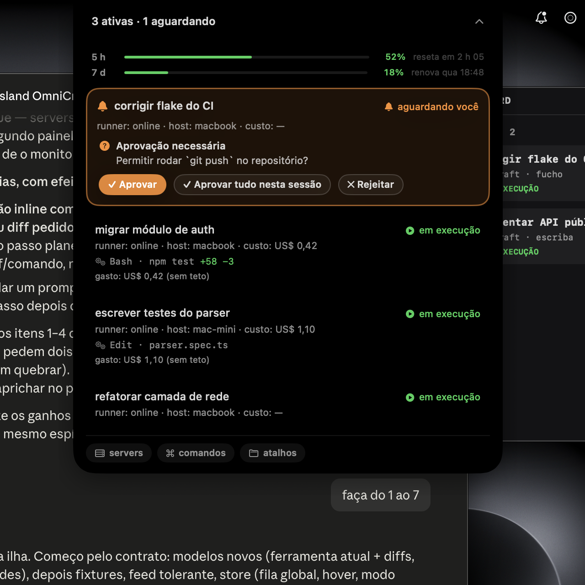 |
| Ilha sem atenção (cenário 2) | 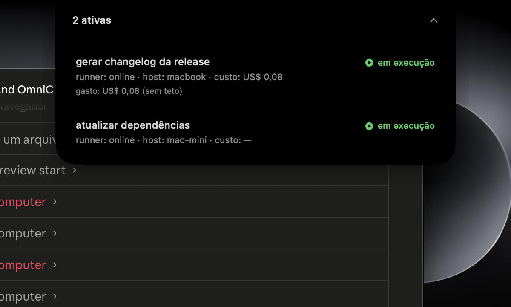 |
| Uso com e sem teto (cenário 6) | 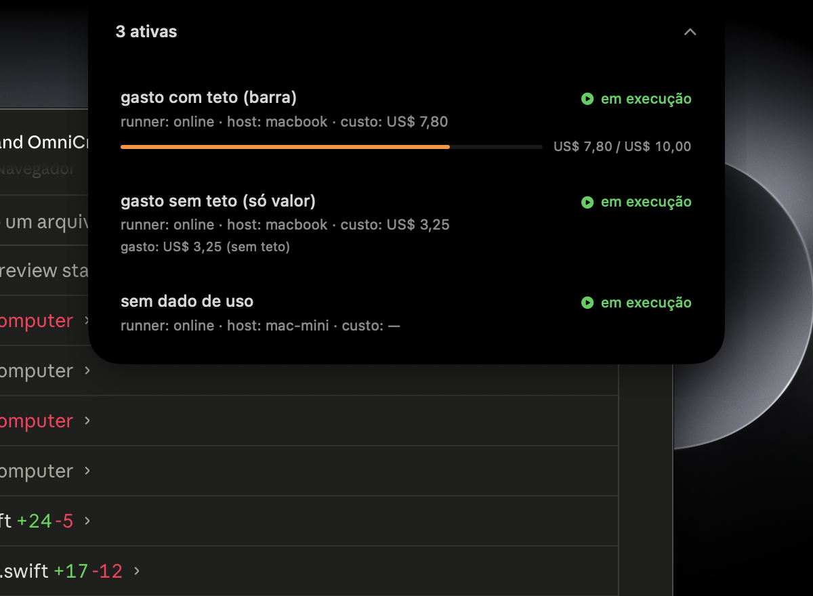 |
| Degradado — piso e desconhecido (cenário 4) | 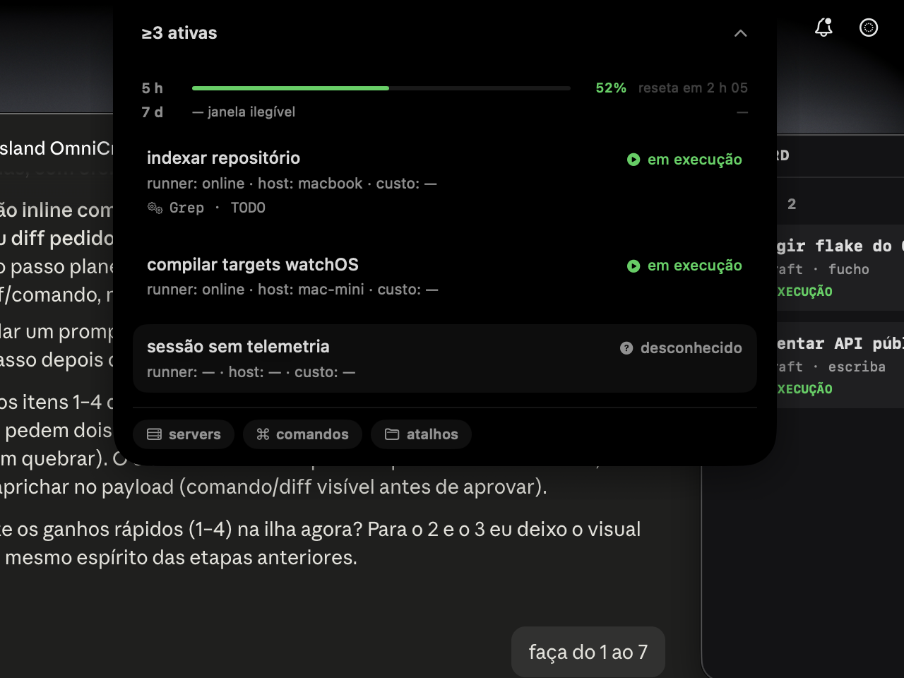 |
| Contagens ilegíveis (cenário 5) | 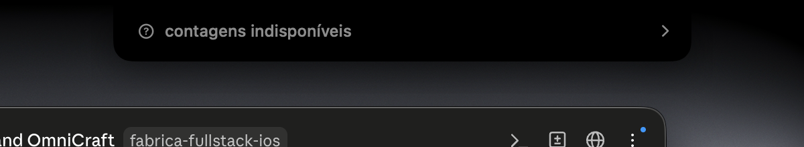 |
| Falha (cenário 7) | 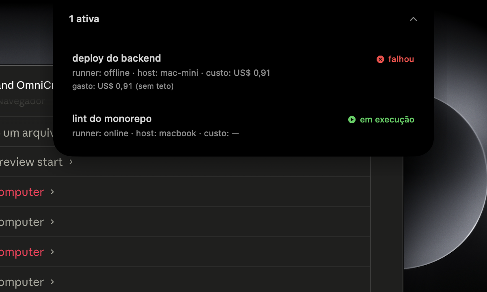 |
| Fila global de pedidos ‹ 1 de 3 › (cenário 8) | 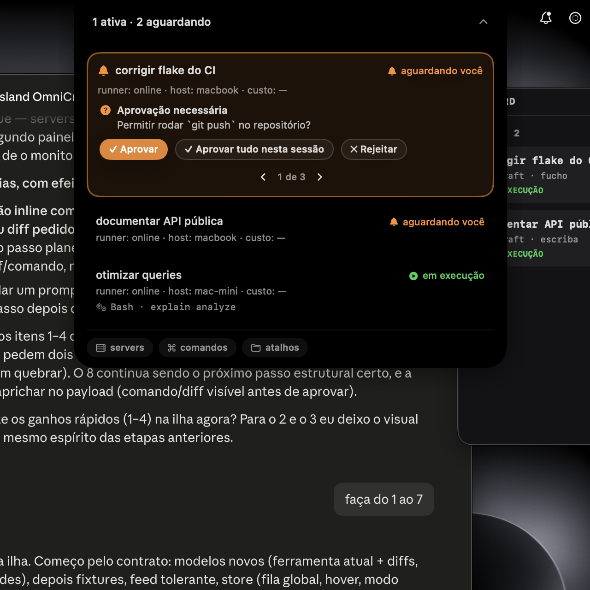 |
| Utilidades (comandos com copiar) | 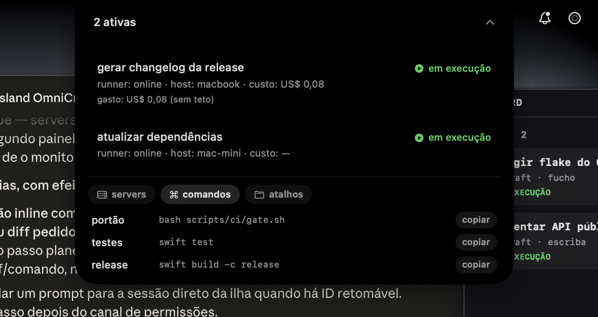 |
| **Feed real** — pill | 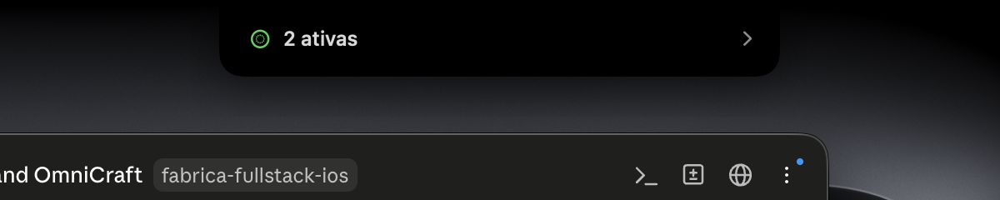 |
| **Feed real** — ilha (sessões reais, degraded visível, rolagem) | 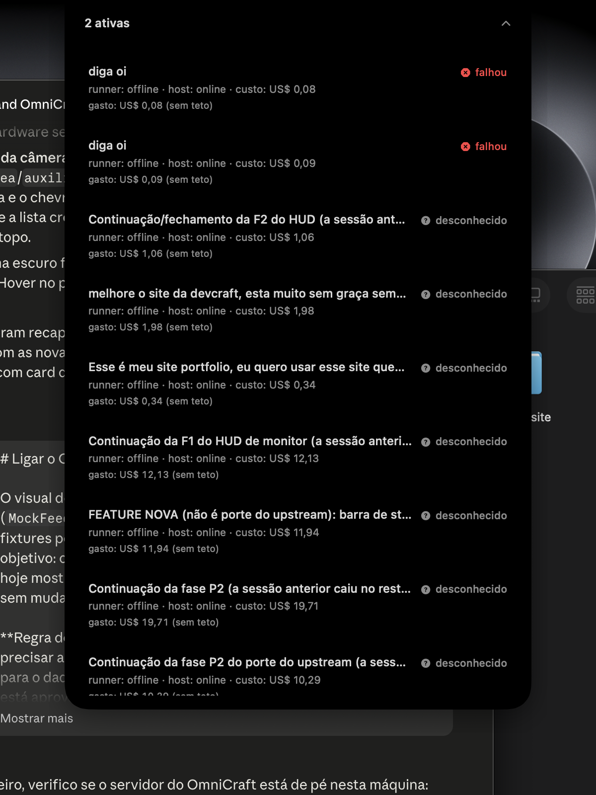 |
| **Feed real** — desconectado (pill) | 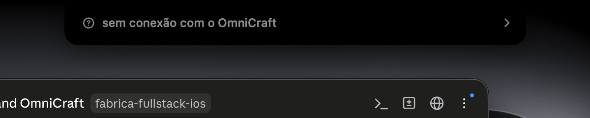 |
| **Feed real** — desconectado (ilha) | 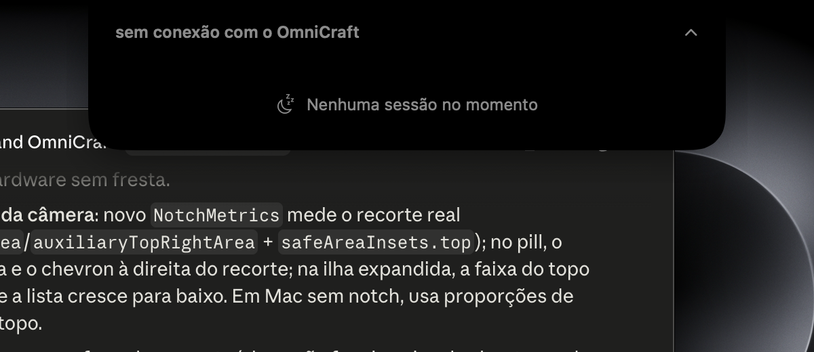 |

## Arquitetura (resumo)

```
Sources/OmniCraftNotch/
├── OmniCraftNotchApp.swift   # @main acessório + MenuBarExtra de debug + args de launch
├── NotchPanel.swift          # NSPanel borderless/non-activating ancorado na notch
├── Models.swift              # SessionState, Usage, CountsSummary, formatação pt-BR
├── MockFeed.swift            # as 8 fixtures (IDs estáveis, sem rede)
├── FeedClient.swift          # DTOs tolerantes + GET + FeedMapper (as 4 regras)
├── HUDStore.swift            # @Observable: fonte mock/live, polling, backoff, atenções vistas
└── Views/
    ├── NotchHUDView.swift    # raiz: pill ↔ ilha com mola, Reduce Motion, medição
    ├── CollapsedPillView.swift
    ├── ExpandedIslandView.swift
    ├── SessionRowView.swift
    ├── AttentionCardView.swift
    └── UsageGaugeView.swift
```

Decisões que importam:

- **Nunca rouba foco**: `NSPanel(.nonactivatingPanel)` com `becomesKeyOnlyIfNeeded`;
  nível `.statusBar`, presente em todos os Spaces e sobre apps em tela cheia.
- **Cliques no topo da tela**: o hosting view aceita *first mouse* (senão o AppKit
  consome o primeiro clique de um app inativo), e o `level` é definido por último —
  `isFloatingPanel` reseta o nível para `.floating` (3), que fica ABAIXO da janela
  "Menubar" do sistema (24), e ela engole os cliques da faixa da notch.
- **Fundida com a notch**: painel colado no topo da tela (override de
  `constrainFrameRect` — sem ele o AppKit empurra a janela para baixo do menu bar),
  fundo preto sólido com só os cantos inferiores arredondados, e conteúdo
  distribuído nas laterais do recorte da câmera (`NotchMetrics`: largura via
  `auxiliaryTopLeftArea`/`auxiliaryTopRightArea`, altura via `safeAreaInsets.top`,
  com fallback para Mac sem notch). O SwiftUI reporta o tamanho a cada frame e o
  painel se re-ancora no topo-centro.
- **Honestidade dos dados**: `nil` vira `—`; piso vira `≥`; barra de uso só existe
  com gasto **e** teto (sem denominador não há porcentagem).
- **Acessibilidade**: estado sempre ícone + texto; rótulos/hints em tudo; hover e
  foco visíveis; elementos focáveis por teclado; Reduce Motion respeitado.
- A ilha é sempre preta (como a notch física), com esquema escuro forçado no
  conteúdo — funciona igual sobre tema claro ou escuro do sistema.
