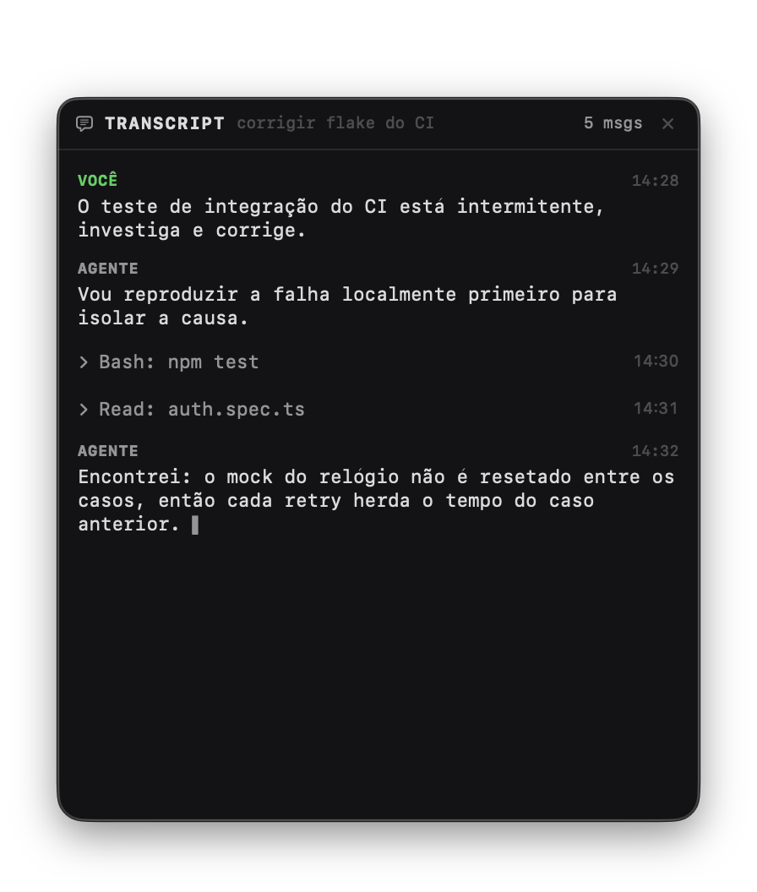
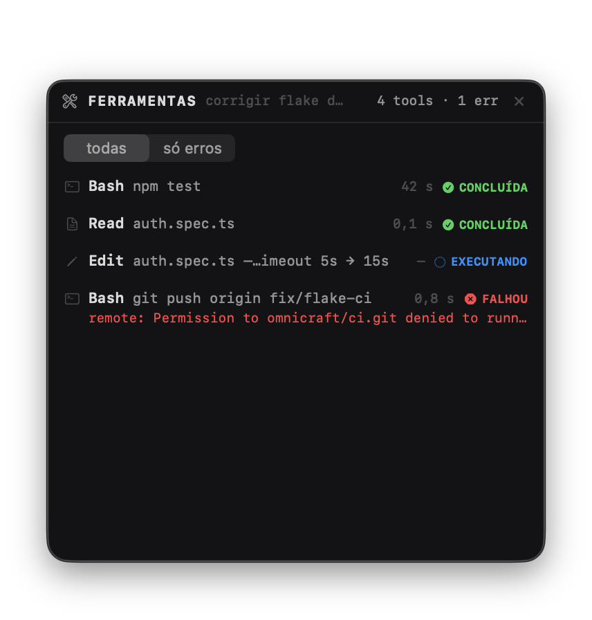
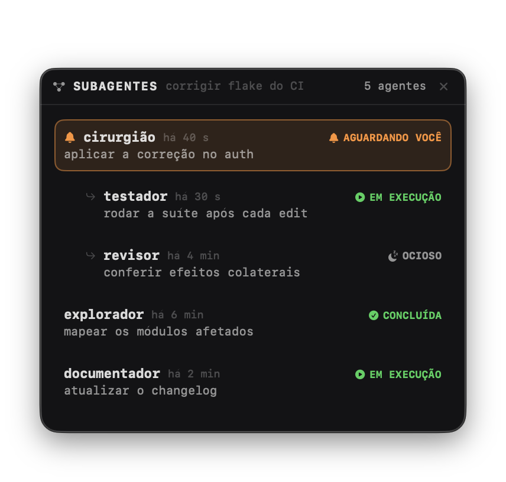
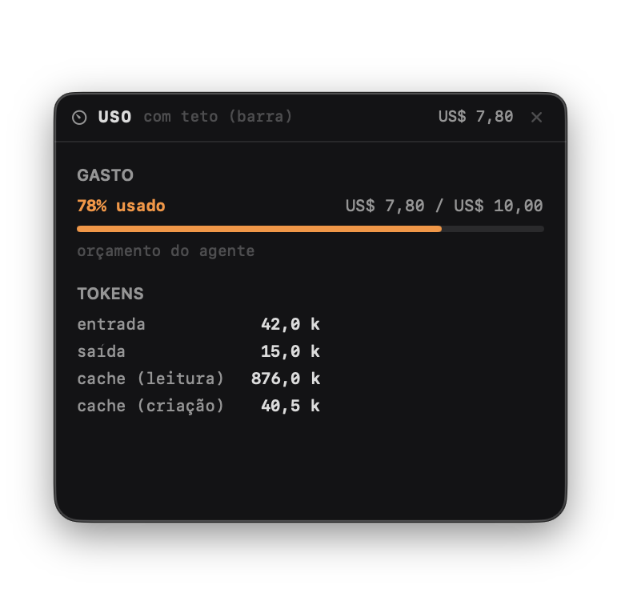
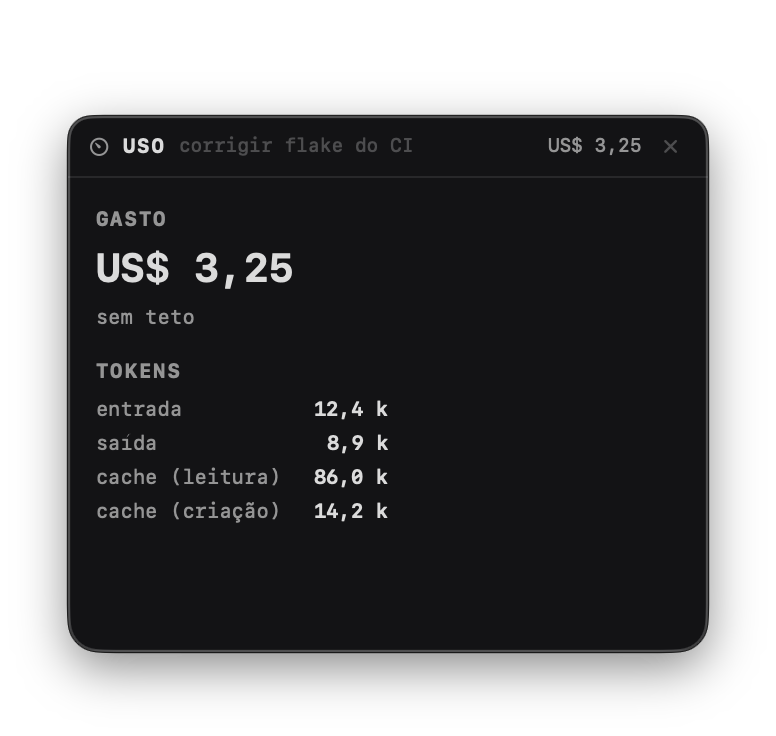
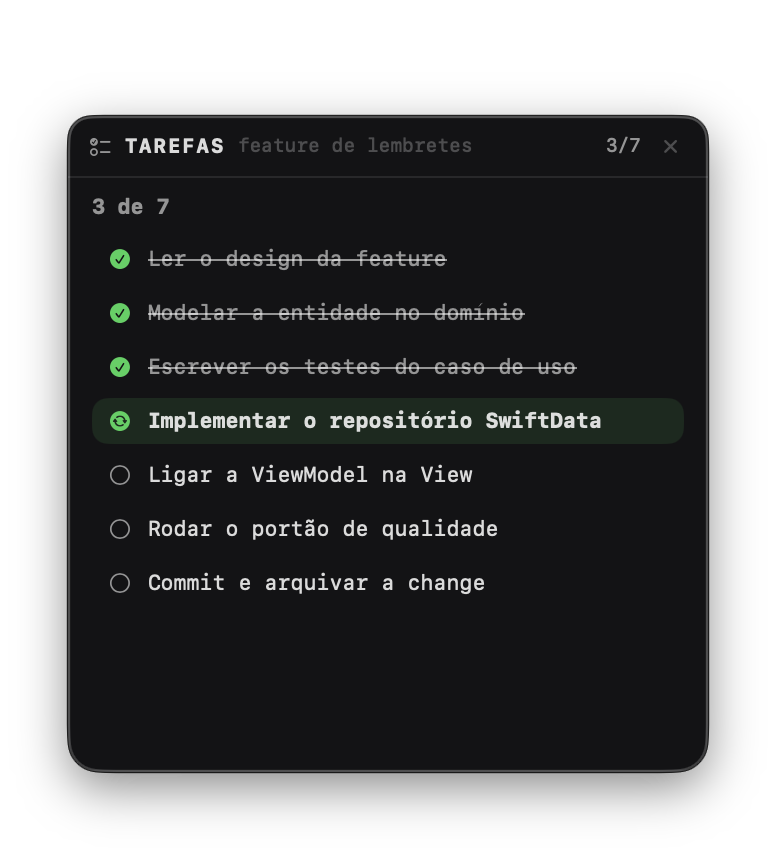
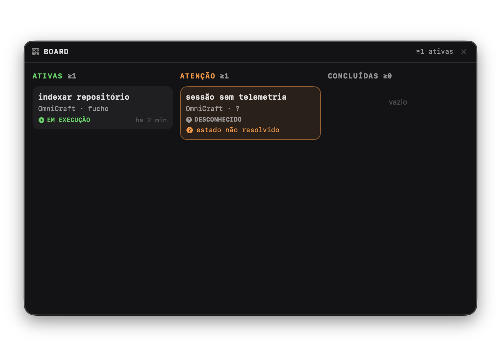
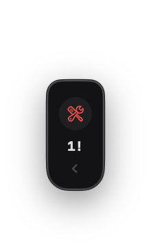
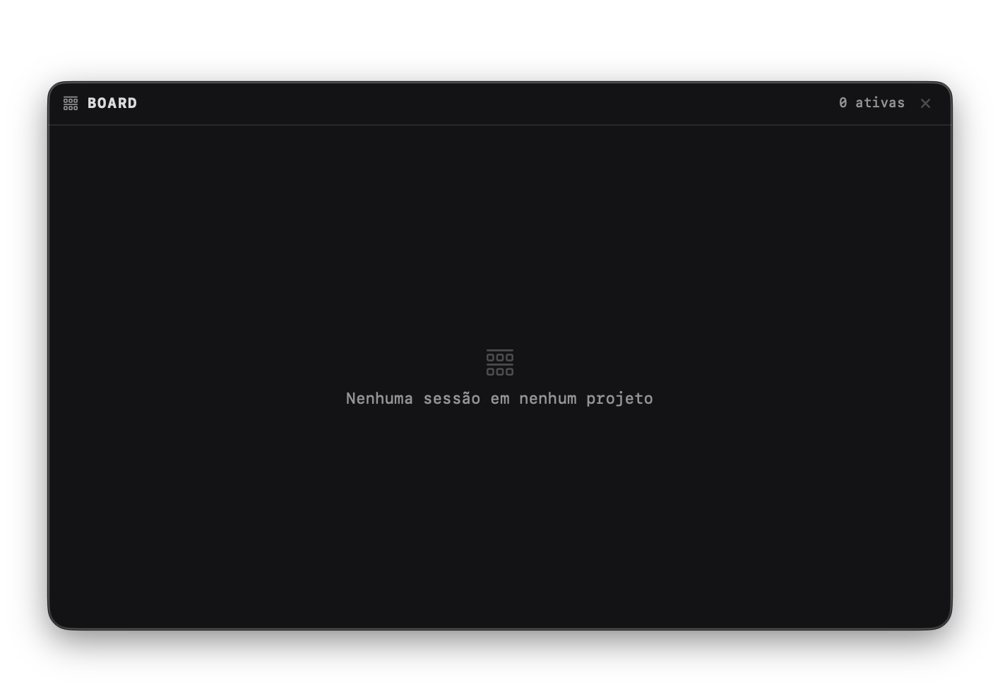
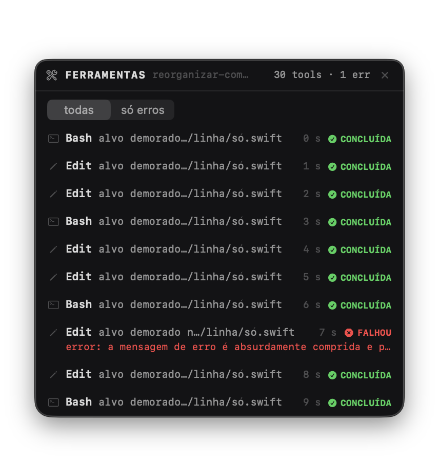

# OmniCraft Widgets — camada visual dos painéis flutuantes

Widgets nativos (Swift + SwiftUI, macOS 14+) do mesmo produto do
[OmniCraftNotch](../OmniCraftNotch/): painéis independentes, always-on-top e que
**nunca roubam foco**, para acompanhar agentes de IA sem manter a janela principal
aberta. **Só interface**: todos os dados vêm de fixtures (`MockFeed`) — nenhuma rede.

Mesma linguagem visual do notch: rótulos de estado idênticos (`em execução` ·
`aguardando você` · `ocioso` · `falhou` + `concluída`/`desconhecido`), o mesmo âmbar
de atenção e formatação pt-BR. Estética de painéis pretos sólidos sempre escuros,
tipografia monoespaçada densa, headers com contagem à direita ("4 tools · 1 err"),
chips de estado em caixa alta, glifo por ferramenta e rail em badge mínimo.

## Rodar

```bash
swift build
.build/debug/OmniCraftWidgets                      # ícone ▦ na barra de menus
.build/debug/OmniCraftWidgets --cenario 7 --widget board
.build/debug/OmniCraftWidgets --cenario 5 --widget todos
.build/debug/OmniCraftWidgets --cenario 5 --rail ferramentas   # abre já no rail
```

O menu ▦ na barra de menus é o debug: cenário, sessão selecionada e "destacar" cada
widget (os botões de ação apenas registram em log — responder permissão/cancelar é
etapa posterior).

## Os widgets

| Widget | O que mostra |
|---|---|
| **Transcript** | Conversa da sessão (você/agente, horário), blocos de ferramenta colapsados (`▸ Bash: npm test`) expansíveis, streaming com cursor ▌, auto-scroll preso no fim que pausa ao rolar para cima (botão "voltar ao fim") |
| **Ferramentas** | Chamadas em ordem: nome, alvo em 1 linha, duração, estado; falha mostra SÓ a primeira linha do erro; filtro todas/só erros |
| **Subagentes** | Árvore de workers (aninhamento com indentação), mesmo vocabulário de estado; quem precisa de atenção sobe com ícone E cor |
| **Uso** | Janelas de limite do provedor (`5 h · 52% · reseta em 2 h 05` — denominador real, barra legítima; ilegível → `—`) + gasto + tokens. Barra de gasto SÓ com teto, rotulada "orçamento do agente"; sem teto → texto; sem dado → `—` |
| **Tarefas** | Lista do turno com `pendente/em andamento/concluída`, destaque na atual, contador `3 de 7` |
| **Board** | Global: colunas **Ativas / Atenção / Concluídas** DERIVADAS do estado (sem arrastar à mão), com motivo no card de Atenção, subestado vivo (`compactando · 45 s`), migração animada e coluna cheia colapsada em 4 + "mostrar todas as N" |
| **Servidores** | Porta + framework + projeto + uptime, botões abrir/copiar/parar (copiar usa o clipboard real), grupo "outros ouvintes", parado marcado em texto |
| **Rotas** | Grade de pastas/recursos do agente (Skills, Config, Hooks, Logs, MCP, Sessões, Raiz, Plugins) com tiles coloridos |

## Comportamentos

- **Janela por widget**: `NSPanel` não-ativante (nunca rouba foco), sem moldura
  visível, material translúcido, movível pelo fundo e redimensionável (280–640 pt).
- **Rail compacto**: arraste até a borda esquerda/direita → encolhe numa faixa com
  ícone + um número (transcript: nº de mensagens; ferramentas: nº de erros; uso:
  gasto; tarefas: `3/7`; board: sessões em Atenção). Clique expande de volta.
- **Posição e tamanho lembrados** por widget × projeto (`UserDefaults`,
  chave `frame.<projeto>.<widget>`).
- **Nunca sai da área visível** — clamp no arrasto, em qualquer display.
- **Cascata**: destacar vários nunca nasce empilhado no mesmo pixel.
- Painéis sempre escuros (preto sólido, como a referência e a notch); Reduce Motion
  respeitado (migração do board e rail viram fade/sem animação).
- Lições do notch aplicadas: hosting view aceita *first mouse* e o `level` da
  janela é definido por último (styleMask/painel resetam o level).

## As quatro regras

1. Barra **só com denominador** (gasto E teto) — nunca % de número absoluto.
2. O teto é o **"orçamento do agente"** (pode existir limite mais apertado).
3. **Dado não resolvido nunca vira silêncio**: `desconhecido` visível, coluna
   Atenção, contagem piso com `≥`.
4. **Nada inventado**: ausente é `—`, nunca `0`.

## Cenários do menu de debug

| # | Cenário | O que exercita |
|---|---|---|
| 1 | Transcript em streaming | Mensagens + blocos colapsados + cursor ▌ chegando em pedaços (timer) |
| 2 | Aguardando permissão | Sessão com motivo âmbar; aparece na coluna Atenção do board |
| 3 | Orquestrador + subagentes | Árvore com 3 workers, um com filhos aninhados; atenção no topo |
| 4 | Uso ×3 | Sessões com teto (barra), sem teto (texto) e sem dado (`—`) — troque a "Sessão" no menu |
| 5 | Ferramentas | Executando (duração `—`), concluída e falha com 1ª linha do erro |
| 6 | Tarefas | 7 tarefas, contador `3 de 7`, destaque na em andamento |
| 7 | Board cheio (migração) | 8 sessões nas 3 colunas; uma migra sozinha a cada 3,5 s (animação) |
| 8 | Degradado | `desconhecido` na Atenção (nunca some) + contagens piso `≥` |
| 9 | Vazio | Estado vazio digno de cada widget |
| 10 | Extremos | 40 mensagens, 30 ferramentas, título gigante, erro comprido truncado |

## Screenshots

| Estado | Imagem |
|---|---|
| Transcript (streaming, blocos colapsados) |  |
| Ferramentas (filtro, falha com 1ª linha) |  |
| Subagentes (atenção no topo, aninhamento) |  |
| Uso com teto (barra + "orçamento do agente") |  |
| Uso sem teto (texto, sem barra) |  |
| Tarefas (`3 de 7`) |  |
| **Board com as três colunas** (subestados, migração) | _recaptura pendente_ |
| **Servidores** (uptime, outros ouvintes) | _recaptura pendente_ |
| **Rotas** | _recaptura pendente_ |
| Board degradado (`≥`, desconhecido) |  |
| **Rail compacto** (ferramentas com erro) |  |
| Vazio |  |
| Extremos (erro comprido truncado) |  |

## Arquitetura

```
Sources/OmniCraftWidgets/
├── Models.swift              # tipos PUROS (só Foundation) — o contrato p/ o feed real
├── MockFeed.swift            # os 10 cenários
├── WidgetStore.swift         # @Observable: cenário, sessão selecionada, timers de simulação
├── WindowManager.swift       # NSPanel por widget: rail, persistência, clamp, cascata
├── OmniCraftWidgetsApp.swift # acessório + menu de debug + args de terminal
└── Views/
    ├── SharedViews.swift     # chrome, badge de estado (ícone+texto), rail, vazio
    ├── TranscriptView.swift
    ├── FerramentasSubagentesView.swift
    ├── UsoTarefasView.swift
    └── BoardView.swift
```
