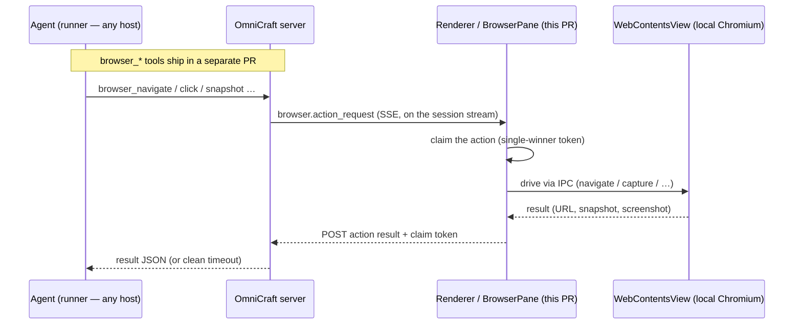

# OmniCraft Desktop (Electron)

Um shell de desktop fino em [Electron](https://www.electronjs.org) em volta
da web UI existente do OmniCraft. Ele mostra a **mesma** UI que você tem num
navegador, mas acrescenta mordomias nativas:

- **Notificações de desktop nativas do SO** (via a API `Notification` do
  processo principal) quando um agente termina um turno (`running` →
  `idle`/`failed`), levanta uma elicitação nova (pede input), ou um runner
  desconecta (`online` → `offline`). Uma notificação dispara para qualquer
  evento desses **exceto** a conversa que você está vendo ativamente (janela
  em foco _e_ aquele chat aberto). Sessões já assentadas no lançamento não
  disparam; só transições novas que este cliente observa disparam. Num
  fim-de-turno o corpo da notificação mostra as **primeiras linhas da
  mensagem final do agente** quando conseguem ser buscadas (uma chamada
  `GET /items` best-effort), caindo para um genérico "Agent finished and is
  ready for your input." quando não. No macOS cada notificação também pode
  **tocar um som** — um som de sistema que você escolhe no menu
  **Notifications** (veja abaixo). É **desligado por padrão (opt-in)**: uma
  instalação nova fica silenciosa até você ligar, então o som nunca
  surpreende.
- **Um sinal de atenção em primeiro plano.** macOS (e Windows) suprimem o
  _banner_ de notificação para o app em **primeiro plano** — e o macOS
  suprime o **som** dela também — então a notificação ainda chega no
  Notification Center, mas nenhum toast aparece (e no macOS nenhum som
  toca), o que passa a impressão de que "notificações só funcionam quando o
  app está em segundo plano". Como a camada web já só notifica para sessões
  que você _não_ está vendo ativamente, o shell acrescenta sinais em nível
  de SO que o app em primeiro plano _consegue_ produzir: ele **quica o ícone
  do dock no macOS** (ou pisca o frame da taskbar no Windows/Linux), e no
  macOS ele **toca o som escolhido ele mesmo** (via `afplay`) em vez do som
  de notificação suprimido. Como é o shell que toca, o alerta é audível
  **estando o OmniCraft em segundo ou primeiro plano** — e o som do toast em
  si é mudo para que o sinal nunca dobre.
- **Múltiplas janelas** (**Server → New Window**, `Cmd/Ctrl+N`). Cada janela
  é uma view independente, abrindo na URL da janela atual, então você pode
  navegá-la para uma conversa diferente e acompanhar duas lado a lado. Uma
  janela também pode ser aberta contra um **servidor diferente** (veja
  "Múltiplos servidores" abaixo). Notificações e o badge do dock são do app
  inteiro (um badge para todas as janelas); um clique na notificação foca a
  janela que a disparou.
- **Um badge de dock / taskbar mostrando o número de sessões não lidas** o
  tempo todo (badge do dock no macOS, contagem do Unity launcher no Linux,
  via `app.setBadgeCount`). Uma sessão vira "não lida" quando termina um
  turno ou pede input enquanto você não está vendo ela ativamente, e é
  limpa no momento em que você a vê. Desconexões de runner notificam mas
  **não** contam para o badge.
- **O menu nativo padrão** (App / Edit / View / Window / Help) construído a
  partir dos roles de menu do Electron, então os atalhos usuais de edição de
  texto — Cmd/Ctrl-A, C, V, X, Z — funcionam dentro dos campos de texto da
  webview. Nossas ações customizadas — **New Window**, **New Window on
  Different Server…** e **Change Server…** — vivem num submenu **Server**
  dedicado. No macOS, um submenu **Notifications** liga/desliga o som de
  notificação (**Play Notification Sound**, **desligado por padrão** — o
  usuário faz opt-in) e escolhe qual som de sistema do macOS tocar
  (**Sound ▸** — Glass, Ping, Hero, …); escolher um faz uma prévia, e a
  escolha persiste em `settings.json` e se aplica à próxima notificação.
- **Arrastar-e-soltar de arquivo estilo navegador** funciona sem
  configuração: o Electron não intercepta drops de arquivo do jeito que o
  Tauri faz por padrão, então soltar uma imagem num campo de texto chega ao
  handler HTML5 de drop do app web sem nenhuma configuração extra.
- **Permissão de microfone para ditado por voz.** O botão de ditado do
  composer usa a Web Speech API mais um stream de áudio `getUserMedia` (o
  medidor de nível de mic). Os dois passam pela camada de permissão do
  Chromium, que no Electron pergunta ao _embedder_ (nós) em vez de mostrar
  o prompt do Chrome — sem handler nenhum plugado, o Chromium nega por
  padrão, então `recognition.start()` falha na hora com `not-allowed` e o
  botão parece morto. O processo principal agora conecta
  `setPermissionRequestHandler` / `setPermissionCheckHandler` para conceder
  as permissões de áudio, e no macOS chama
  `systemPreferences.askForMediaAccess("microphone")` de forma preguiçosa —
  na primeira requisição de mic de fato (o usuário clicando em ditado), não
  na inicialização do app — para que o portão de mic a nível de SO também
  esteja aberto (builds empacotados vêm com
  `NSMicrophoneUsageDescription`).

  > **Ressalva — o Web Speech ainda pode não transcrever no Electron.**
  > Conceder o mic limpa o portão de _permissão_, mas o `SpeechRecognition`
  > também depende do backend de fala em nuvem do Google, atrelado a builds
  > oficiais do Google Chrome, que o Chromium empacotado do Electron **não**
  > traz. Então o reconhecimento ainda pode falhar (tipicamente um erro
  > `network`) mesmo com o mic permitido. O app web degrada com
  > elegância (o botão mostra "Dictation unavailable" em vez de quebrar).
  > Ditado in-app totalmente confiável exigiria uma captura via
  > MediaRecorder + um endpoint de transcrição no servidor (ex.: Whisper)
  > plugado ao fallback `onAudioRecorded` já existente do composer — ainda
  > não implementado.

## Como funciona (zero duplicação de UI)

O app de desktop **não** embarca uma cópia da web UI. Ele empacota só uma
página pequena de "conectar ao servidor" (`setup/index.html`). No
lançamento:

1. Se nenhuma URL de servidor está salva ainda, ele mostra a página de setup
   (um input + Connect). Você digita a URL do seu servidor OmniCraft
   (padrão `http://localhost:8000`).
2. Ele persiste essa URL no diretório de dados do app por usuário
   (`settings.json` sob o caminho `userData` do Electron) e **carrega a
   origem do próprio servidor**, onde o servidor serve a SPA real (o build
   `web` de produção, os mesmos bytes que um navegador carregaria).
3. Nos lançamentos seguintes ele pula a página de setup e carrega o
   servidor salvo diretamente.

Se o servidor salvo falha ao carregar (servidor fora do ar, falha de DNS,
erro de TLS), a janela cai de volta para a página de setup com o erro
mostrado e a URL que falhou pré-preenchida — a URL salva é mantida, então
Connect simplesmente tenta de novo.

Digitar uma URL `http://` pura para um host **não-local** mostra um aviso
antes (qualquer um no caminho de rede pode agir como aquele servidor); um
segundo clique em Connect prossegue. `http://localhost:8000` conecta sem
atrito.

Troque o servidor depois pelo item de menu **Server → Change Server…**, que
limpa a URL salva e volta a janela em foco para a página de setup.

Abra outra view com **Server → New Window** (`Cmd/Ctrl+N`). Ele clona a URL
atual da janela em foco numa janela nova contra o mesmo servidor, para que
duas conversas possam ser acompanhadas ao mesmo tempo.

As melhorias nativas vivem do lado web em
[`../src/lib/nativeBridge.ts`](../src/lib/nativeBridge.ts). Ele detecta o
shell Electron em tempo de execução (o preload expõe
`window.omnicraftDesktop` com `kind: "electron"`) e roteia
notificações/badge pela bridge de IPC; num navegador comum ele cai para o
caminho de Web Notifications. Então o mesmo bundle `web` funciona tanto num
navegador quanto sob o Electron.

## Arquitetura

```
electron/
  package.json             # dependências e config de build do Electron + electron-builder
  src/main.js              # processo principal: janela, settings, menu, IPC, badge, notify
  src/preload.js           # contextBridge: window.omnicraftDesktop + omnicraftSetup
  src/find_preload.js      # contextBridge para a barra de busca: window.omnicraftFind
  src/browserViewRegistry.js  # registro de WebContentsView por conversa (pane de navegador)
  src/browserViewBounds.js    # conversão de bounds CSS-px → window-DIP (pane de navegador)
  src/browserIpc.js           # handlers de IPC omnicraft:browser-* (extraído de main.js)
  setup/index.html         # a página de setup "conectar ao servidor" embarcada
  find/index.html          # a barra de busca-na-página embarcada (Cmd/Ctrl+F)
  icons/                   # ícones do app
```

Mordomias nativas além de notificações/badge: um menu de contexto de
clique-direito (recortar/copiar/colar, sugestões de ortografia + Add to
Dictionary, Copy Link Address), persistência de tamanho/posição de janela
entre lançamentos, e busca-na-página (**Edit → Find…**, `Cmd/Ctrl+F`) — uma
barra pequena ancorada no canto superior direito da janela; Enter /
Shift+Enter percorrem os resultados, Esc dispensa.

- O **processo principal** (`src/main.js`) é dono da persistência de
  settings, criação de janela, o menu da aplicação, o tratamento de
  permissão (microfone), e os handlers de IPC para o badge e as
  notificações (`normalize_url`, `change_server`, navegar-para-servidor,
  New Window).
- O **preload** (`src/preload.js`) é a única ponte entre a SPA remota (não
  confiável) e o processo principal. Ele roda com `contextIsolation` e
  expõe uma API minúscula, segura para serialização, via `contextBridge` —
  nunca `ipcRenderer` ou Node cru.
- **Postura de segurança**: `nodeIntegration: false`, `contextIsolation:
true`. Links `window.open` / `target=_blank` são abertos no navegador
  real do usuário, não em janelas Electron sem chrome. Esquemas não-web
  (`vscode://`, `ssh://`, …) lançam um handler de protocolo do SO com
  argumentos controlados pela página, então pedem consentimento antes —
  mostrando a origem requisitante e a URL inteira — com um "sempre permitir
  esse esquema deste servidor" opcional e persistido. Além disso, cada
  janela é **fixada na única origem de servidor que o usuário conectou
  explicitamente nela**, e essa fixação — não a navegação — é o limite de
  confiança:
  - A navegação deliberadamente _não_ é restrita: servidores podem estar
    atrás de autenticação que redireciona por provedores de identidade
    externos, então uma janela pode legitimamente visitar origens
    estrangeiras no meio de um login.
  - Em vez disso, todo handler de IPC privilegiado verifica o seu frame
    remetente. `notify` / `setBadgeCount` só funcionam quando tanto o frame
    chamador _quanto_ a página de nível superior da janela estão na origem
    fixada (então um iframe de origem fixada embutido numa página hostil
    não recebe nada); a bridge de setup (`omnicraftSetup`) só funciona para
    a própria página de setup embarcada, então uma página de servidor
    nunca consegue ler ou repontar silenciosamente a URL de servidor
    salva. Páginas estrangeiras recebem uma bridge inerte.
  - A concessão de permissão de microfone é igualmente delimitada: só o
    conjunto de áudio, só para páginas numa origem que alguma janela tem
    fixada, e só quando a página requisitante é a página de nível
    superior — tudo o resto é negado.

## Pane de navegador embutido

O shell de desktop hospeda um **pane de navegador embutido**: uma página
Chromium real que o usuário pode dirigir (barra de URL + toolbar) e
apontar-e-comandar em modo de design. Esta PR cobre esse pane voltado ao
usuário mais a plumbing de Electron/renderer; as ferramentas builtin
`browser_*` voltadas ao agente (navigate / snapshot / click / type /
screenshot) que também conseguem dirigir o pane entram numa PR separada.
Um webview/iframe não consegue fornecer screenshots, JS arbitrário na
página, ou navegação cross-origin, então cada navegador é uma
**`WebContentsView`** nativa do Electron posicionada sobre um `<div>` de
placeholder que a SPA mede — não um elemento in-page.



O navegador roda na máquina do usuário (uma `WebContentsView` nativa); o
agente — que pode rodar num host diferente — o dirige puramente por
mensagens: uma requisição de ação sai em fanout pelo stream da sessão, o
renderer a reivindica e a executa contra o seu Chromium local, e o
resultado é postado de volta.

**Peças:**

- `src/browserViewRegistry.js` — um `Map` por **conversa** de
  `WebContentsView`s (limite de 10). `setActive` anexa uma view à janela
  hospedeira e **desanexa (não destrói)** a anterior, então a página de uma
  conversa em segundo plano continua rodando quando o usuário troca de
  view; views só são destruídas no fechamento explícito ou na desmontagem
  da janela. Cada view filha mantém
  `nodeIntegration:false, contextIsolation:true, sandbox:true`.
- `src/browserViewBounds.js` — converte os pixels CSS do renderer do
  placeholder para pixels device-independent da janela (eles divergem
  depois de zoom com `Cmd+/Cmd-`).
- `src/main.js` — instancia um registro **por janela do shell** e o injeta
  (mais o portão de confiança `isPinnedOriginSender`) em
  `registerBrowserIpc(...)`.
- `src/browserIpc.js` — toda a superfície
  `ipcMain.handle('omnicraft:browser-*')`, extraída de `main.js` para que
  esse arquivo continue limitado: `open-or-navigate`, `set-active`,
  `resize`, `screenshot` (`capturePage().toPNG()` → base64), `execute`,
  `has-view`, `close`, mais os handlers de toolbar `go-back`, `go-forward`,
  `reload` e `open-devtools` (toggle, ancorado embaixo), mais os handlers
  de modo de design `enable-design-mode` / `disable-design-mode` /
  `signal-design-result` (injetar / desmontar o seletor de elemento
  in-page e pintar o feedback do resultado). Todo handler é gateado em
  `isPinnedOriginSender` (só a própria página do servidor conectado pode
  dirigir as views) e resolve o registro _da própria janela remetente_,
  então uma janela nunca consegue manipular os panes de outra. Na criação
  da view ele também conecta listeners `did-navigate` /
  `did-navigate-in-page` que empurram `browser-url-changed` +
  `browser-nav-state` para o renderer, para que a barra de URL da toolbar
  acompanhe a URL real ao vivo (redirects, cliques de link in-page,
  navegação do agente) em vez de ficar desatualizada.
- `src/preload.js` — adiciona
  `browserOpenOrNavigate/SetActive/Resize/Screenshot/Execute/Close` +
  `browserHasView`, os métodos de toolbar
  `browserGoBack/GoForward/Reload` + `openBrowserDevTools`, os métodos de
  modo de design
  `browserEnableDesignMode/DisableDesignMode/SignalDesignResult`, e as
  subscrições `onBrowserViewCreated` / `onBrowserHostActiveChanged` /
  `onBrowserViewClosed` / `onBrowserUrlChanged` / `onBrowserNavState` +
  `onBrowserElementSelected` / `onBrowserElementPromptSubmit` /
  `onBrowserElementPromptDismiss` a `window.omnicraftDesktop`, cada um um
  `ipcRenderer.invoke` / `ipcRenderer.on` fino.
- Lado renderer (em `web/src`): `hooks/useBrowserAgentRelay.ts` recebe o
  evento SSE `browser.action_request` (emitido pela PR separada de
  ferramentas de agente), **reivindica** a ação no servidor (check-and-set
  atômico para que duas janelas num servidor não possam executar em
  duplicidade), a roda via a bridge do preload, e faz POST do resultado de
  volta com o seu token de reivindicação; `components/BrowserPane/BrowserPane.tsx`
  mede o placeholder e mantém a view nativa posicionada sobre ele. Os dois
  se auto-gateiam em `isElectronShell()`, então uma aba de navegador comum
  fica inerte (a ação expira no servidor com um erro limpo de "o app de
  desktop está aberto?").

**Ativação no primeiro navigate.** O primeiro `browser_navigate` numa
conversa cria a view **desanexada** (nada está ativo ainda), então nenhum
`browser-host-active-changed` dispara. O registro por isso também emite um
evento `browser-view-created` na criação; `BrowserPane` escuta por ele (e
sonda `browserHasView` na remontagem), monta o seu placeholder de medição,
e chama `browserSetActive(conversationId)` — que anexa a view e começa a
sincronização de bounds. Sem esse sinal o pane se gatearia para sempre e o
navegador embutido ficaria invisível para sempre.
(`browserViewRegistry.test.js` fixa a transição
create-signal → setActive → attached.)

**Toolbar.** Quando uma view está anexada, `BrowserPane` renderiza uma
toolbar voltada ao usuário acima da página: voltar / avançar / recarregar,
um toggle de DevTools, e uma barra de URL editável (Enter navega; o valor
digitado é normalizado para adicionar um esquema — um host sem ponto como
`localhost` recebe `http://`, tudo o resto `https://`). A barra reflete a
URL _real_ via `onBrowserUrlChanged`, mas nunca sobrescreve o que o usuário
está digitando ativamente. O pane é uma **coluna** flex: a toolbar é uma
linha de altura fixa _acima_ do container medido, porque a
`WebContentsView` nativa pinta sobre o retângulo desse container — uma
toolbar dentro dele ficaria escondida pelo overlay. A barra de URL
reaproveita o caminho `browserOpenOrNavigate(..., {force:true})` já
existente (o mesmo que o relay usa), então nenhuma IPC de navegação
separada existe para entrada manual.

**Modo de design (apontar-e-comandar).** Um toggle na toolbar (ao lado do
DevTools) injeta um seletor de elemento in-page na `WebContentsView` via
`executeJavaScript`: passar o mouse destaca o elemento sob o cursor
(overlay + label `<Component>`/tag); clicar abre um popup ancorado naquele
elemento com um input + Send. No Send o popup emite um marcador
`console.log` (o script injetado não consegue `require('electron')`), que
o listener de mensagem de console por view em `browserIpc.js` encaminha
para a SPA como `browser-element-prompt-submit` (carregando a informação
do elemento; um screenshot recortado do elemento chega no evento anterior
`browser-element-selected`). **Não existe rota de edição de design no
backend** — o `AppShell` (onde o relay é hospedado, então ele fica
escutando mesmo quando a aba Browser não está montada) constrói um prompt
`[Design Mode — …]`, anexa o screenshot como um `File`, e o manda pelo
caminho de chat _normal_ (`chatStore.send`, mirando o agente vinculado à
própria conversa). Depois ele chama `browserSignalDesignResult` para que
o popup pinte o feedback verde/vermelho. Os marcadores do seletor são
`__omni_element_select__` / `__omni_element_prompt_submit__` /
`__omni_element_dismiss__`, e o listener de console por view fica
guardado na entrada do registro (`designModeListener` /
`designModeWebContents`) para que o `close()` do `browserViewRegistry` o
desconecte na desmontagem. Só Electron (precisa de `executeJavaScript` +
a view nativa); sem flag de servidor.

**Limite de confiança de JS (importante):** `omnicraft:browser-execute`
roda JS arbitrário na view filha via `executeJavaScript(js, true)`. Ele é
exposto à SPA **só para os próprios templates fixos do relay** (a
varredura de snapshot do DOM, e os resolvedores de elemento de
click / type) — deliberadamente **não existe** um `evaluate` genérico
voltado ao agente. Isso mantém o limite do _agente_: o agente escolhe
elementos por `ref`/`selector` e fornece texto, mas nunca envia uma string
de JS crua para o main rodar. (Isso não defende, e não pretende defender,
contra XSS _dentro_ da página visitada — aquela página roda os próprios
scripts na sua própria view sandboxada de qualquer jeito.) Preserve isso
ao estender a bridge: adicione ações tipadas, com formato de argumento, não
um canal de JS passthrough.

**Disponibilidade.** O pane está sempre ligado neste build — essa
maquinaria do shell ativa no momento em que um `browser.action_request`
chega (as ferramentas `browser_*` do lado do agente que o emitem entram na
PR separada de ferramentas). Nenhuma flag para ligá-lo. Fora do shell
Electron (uma aba de navegador comum) a metade do renderer fica inerte,
então as ferramentas falham de forma limpa com um erro de "o app de
desktop está aberto?" em vez de travar.

## Pré-requisitos

- **Node** 22.x + npm (já usado por `web`).
- O Electron traz o próprio Chromium/Node, então nenhuma lib de webview de
  sistema é necessária no Linux para _rodar_ o app já buildado, embora
  ferramentas de empacotamento possam puxar algumas dependências de build.

## Rodando (desenvolvimento)

A partir do diretório `web/electron/`:

```bash
npm install     # instala electron + electron-builder
npm start        # lança o shell Electron
```

O shell abre na página de setup embarcada. Aponte-o para um servidor
OmniCraft rodando (veja abaixo), clique em Connect, e você está dentro.

> Nota: isso carrega a UI a partir de qualquer URL de servidor que você
> fornecer — ele **não** roda o servidor de dev do Vite. Para desenvolver a
> web UI em si com hot reload, rode `npm run dev` (Vite puro num navegador)
> a partir de `web/` como de costume.

## Buildando um distribuível

A partir de `web/electron/`:

```bash
npm run build             # plataforma atual
npm run build:mac         # .dmg + .zip (assinado se uma identidade estiver disponível, não notarizado)
npm run build:mac:release # .dmg + .zip, assinado + notarizado (exige credenciais, veja abaixo)
npm run build:linux       # AppImage + .deb
npm run build:win         # instalador NSIS
```

A saída fica em `electron/dist/` (o DMG é nomeado
`OmniCraft-<version>-<arch>.dmg`).

## Assinatura de código & notarização no macOS

O build de mac é configurado para o **hardened runtime** da Apple com os
entitlements que o Electron precisa (`build/entitlements.mac.plist`: JIT
do V8 mais microfone para ditado). A assinatura é comandada inteiramente
pelas credenciais presentes — não há mudança de código entre um build de
dev e um build de release:

| Credenciais presentes                                                             | Resultado                                                                     |
| --------------------------------------------------------------------------------- | ----------------------------------------------------------------------------- |
| nenhuma                                                                           | app assinado ad-hoc; roda localmente, outros Macs veem um aviso do Gatekeeper |
| Certificado Developer ID                                                          | app assinado; downloads ainda avisam até ser notarizado                       |
| Certificado Developer ID + credenciais de notarização Apple (`build:mac:release`) | assinado + notarizado; instala limpo em todo lugar                            |

### 1. Obtenha um certificado de assinatura

Você precisa de um certificado **Developer ID Application** de uma conta do
Apple Developer Program (o tipo usado para distribuição _fora_ da App
Store). Crie-o em
<https://developer.apple.com/account/resources/certificates>
(ou via Xcode → Settings → Accounts → Manage Certificates), depois:

- **Keychain (builds locais):** instale o certificado + chave privada no
  seu keychain de login. O electron-builder o descobre automaticamente —
  `npm run build:mac` simplesmente funciona. Verifique com
  `security find-identity -v -p codesigning` (você deve ver
  `Developer ID Application: <Your Name> (<TEAMID>)`).
- **Variáveis de ambiente (CI):** exporte o certificado + chave como um
  `.p12` protegido por senha e defina:

  ```bash
  export CSC_LINK=/path/to/developer-id.p12   # ou uma string base64 / URL https
  export CSC_KEY_PASSWORD='the p12 password'
  ```

Para forçar um build **não assinado** mesmo com um certificado presente
(iteração de dev mais rápida): `CSC_IDENTITY_AUTO_DISCOVERY=false npm run
build:mac`.

### 2. Notarize (builds de release)

A notarização sobe o app assinado para a Apple para varredura de malware;
sem ela, o macOS avisa no primeiro lançamento de um app baixado. Precisa de
acesso à rede e credenciais Apple — ou uma chave de API do App Store
Connect (preferível para CI):

```bash
export APPLE_API_KEY=/path/to/AuthKey_XXXXXXXXXX.p8
export APPLE_API_KEY_ID=XXXXXXXXXX
export APPLE_API_ISSUER=<issuer-uuid>
```

ou o seu Apple ID com uma
[senha específica de app](https://support.apple.com/102654):

```bash
export APPLE_ID=you@example.com
export APPLE_APP_SPECIFIC_PASSWORD=xxxx-xxxx-xxxx-xxxx
export APPLE_TEAM_ID=<TEAMID>
```

depois:

```bash
npm run build:mac:release
```

Esse é o mesmo build com `mac.notarize=true` ligado; espere que o passo de
notarização acrescente alguns minutos (processamento do lado da Apple).
Verifique o resultado com:

```bash
spctl -a -vv dist/mac-arm64/OmniCraft.app   # → "accepted, source=Notarized Developer ID"
```

`build:mac:release` **falha explicitamente** se credenciais de assinatura ou
notarização estão faltando — isso é intencional, para que um artefato de
release não consiga sair sem assinatura silenciosamente.

## Conseguindo um servidor para apontar

Qualquer servidor OmniCraft alcançável funciona. Para um alvo local rápido,
rode o servidor a partir deste repositório:

```bash
# a partir da raiz do repositório, com o venv do projeto:
.venv/bin/python -m omnicraft.server   # serve em http://localhost:8000
```

Depois digite `http://localhost:8000` na página de setup.

## Gerenciando servidores e hosting

Além de apontar para um servidor já rodando, o shell consegue dirigir a CLI
`omnicraft` local para subir um servidor e registrar essa máquina como um
**host** (uma máquina que roda o trabalho de agente que um servidor
despacha). Dois conceitos ficam deliberadamente separados:

- **Servidor** — o backend com o qual a webview conversa (local ou remoto).
- **Host** — _essa máquina_ executando trabalho de agente para um servidor.
  Como hospedar roda código de agente, isso é **opt-in** e **explícito**: o
  shell nunca conecta essa máquina como um runner sozinho — nem no connect,
  nem no lançamento. Você a conecta pelo **menu de seleção de host** dentro
  do app (ao iniciar um chat, escolha essa máquina), que dirige o
  `controlHost` pela bridge. Essa requisição sozinha não é confiável para
  autorizar o hosting: a SPA é servida pelo servidor, então
  `start`/`restart` exigem adicionalmente uma **confirmação nativa do
  processo principal** que a página não consegue forjar nem
  auto-dispensar (persistida por origem de servidor, então um servidor de
  confiança só é perguntado uma vez).

### Detectando a CLI e customizando o caminho dela

A CLI é distribuída sob dois nomes que resolvem para o mesmo entry point —
`omnicraft` (canônico) e `omni` (apelido curto) — e o shell sonda **os
dois**: `settings.omnicraft_path` primeiro, depois `PATH` (`omnicraft`
depois `omni`), depois os locais de instalação conhecidos
(`~/.local/bin`, `~/.cargo/bin`, Homebrew, `/usr/local/bin`, cada um
tentado sob os dois nomes). Um app lançado pela GUI herda um `PATH`
mínimo, motivo pelo qual os locais de instalação são sondados
diretamente. O caminho é resolvido uma vez na inicialização e cacheado em
memória para a sessão.

Você pode ver e mudar qual binário é usado em dois lugares:

- **Página de setup** — escondida por padrão atrás de um **ícone de
  engrenagem** (canto superior direito) que abre um modal pequeno. O
  caminho resolvido/autodetectado aparece como o **placeholder** do campo
  (o valor fica vazio até você digitar uma sobrescrita); defina-o por
  texto livre ou um seletor de arquivo nativo. Quando nada é encontrado a
  engrenagem ganha um ponto de destaque e o modal mostra o comando de
  instalação de uma linha
  ```bash
  curl -fsSL https://raw.githubusercontent.com/omnicraft-ai/omnicraft/main/scripts/install_oss.sh | sh
  ```
- **Dentro do app** — **Settings → Local CLI** (só desktop): mostra o
  caminho e a versão resolvidos, um botão **Change…** (seletor de arquivo
  nativo) e **Reset to auto-detected**. Por segurança a superfície dentro
  do app não expõe **nenhum setter de texto livre** — um servidor
  conectado não pode repontar silenciosamente a CLI para um binário
  arbitrário, então mudá-la exige um diálogo de SO dirigido pelo usuário.

Um caminho configurado é salvo em `settings.json` (`omnicraft_path`) só
depois de validar como uma CLI executável; limpá-lo reverte para
autodetecção. Conectar a um servidor **remoto** nunca precisa da CLI — só
"Start locally" e hosting precisam.

### Start locally

**"Start a server on this machine"** roda `omnicraft server start`
(idempotente — reaproveita uma instância saudável) e depois conecta essa
janela na URL `http://127.0.0.1:<port>` dela pelo fluxo normal de connect.
Não conecta essa máquina como um runner — isso continua sendo um passo
explícito dentro do app.

### Conectando essa máquina como um runner

Não existe toggle no momento do connect nem linha de status na sidebar: o
shell nunca conecta um runner automaticamente. Dentro do app conectado, o
menu de seleção de host (ao iniciar um chat) marca essa máquina e oferece
para conectá-la. Escolhê-la chama `controlHost("start")` pela bridge. Como
essa chamada se origina em código servido pelo servidor, o processo
principal não a trata como o consentimento do usuário: no primeiro
`start`/`restart` para uma origem de servidor ele mostra um **diálogo de
confirmação nativo** ("Allow _host_ to manage OmniCraft on this machine?")
com **Don't Allow** (padrão) / **Allow Once** / **Always Allow**. Só depois
da aprovação ele — assim que a CLI estiver autenticada para o servidor
(só remoto; local não precisa de nada) — ou adota um daemon já servindo
aquele servidor (um que você iniciou à mão) ou lança
`omnicraft host --server <url>`. **Allow Once** conecta dessa vez e
pergunta de novo na próxima; **Always Allow** registra a origem em
`settings.json` (`allowed_hosting_origins`) para que conexões futuras
pulem o prompt. `stop` é fail-safe e não precisa de confirmação. A mesma
bridge expõe `stop` / `restart`.

O status é lido ao vivo (host conectado = um processo de daemon vivo **e**
um túnel de host online; o shell nunca o cacheia). A superfície de host
passa pela bridge JS — `window.omnicraftDesktop` →
`getHostStatus` / `getHostIdentity` / `onHostStatusChanged` (leitura + ao
vivo) e `controlHost` (start/stop/restart), tipada em
[`../src/lib/nativeBridge.ts`](../src/lib/nativeBridge.ts) e gateada na
**origem fixada** da janela, como a bridge de badge/notificação.

### Ciclo de vida

O desktop **é dono dos processos de host que ele inicia**: fechar o app
manda SIGTERM neles (e para um servidor local que ele iniciou), então
fechar o app desconecta essa máquina. Um daemon que o shell só _adotou_
(você o iniciou num terminal) fica rodando depois de fechar. O hosting
**não** é restaurado no próximo lançamento — você reconecta essa máquina
explicitamente pelo menu de host quando quiser.

## Passkeys (WebAuthn)

Chaves de segurança externas (ex.: uma YubiKey) funcionam sem configuração:
a camada de conteúdo do Chromium fala CTAP direto com a chave. É por isso
também que o fluxo é _invisível_ — a folha de passkey que você vê no
Chrome/Safari é chrome do navegador, que o Electron não distribui. Tocar
na chave completa a cerimônia sem UI nenhuma.

Para um fluxo visual, o shell ativa o **autenticador de plataforma Touch
ID** do Electron (`app.configureWebAuthn`, Electron ≥ 42, só macOS):
registrar ou entrar com uma passkey de plataforma então mostra o diálogo
nativo de Touch ID / keychain do macOS, e um seletor nativo aparece quando
várias passkeys salvas combinam. Três peças precisam concordar antes disso
ativar:

1. `WEBAUTHN_KEYCHAIN_ACCESS_GROUP` em `src/main.js` —
   `"<TEAM_ID>.ai.omnicraft.desktop"`.
2. A mesma string no entitlement `keychain-access-groups` em
   `signing/entitlements.mac.plist`.
3. Um **perfil de provisionamento Developer ID embutido**
   (`signing/omnicraft.provisionprofile`, plugado via `provisioningProfile`
   em `package.json`). `keychain-access-groups` é um entitlement
   _restrito_: uma assinatura Developer ID sozinha não o autoriza, e o AMFI
   mata o app com SIGKILL no lançamento ("Launchd job spawn failed", erro
   POSIX 163). Crie o perfil no Apple Developer portal: um App ID para
   `ai.omnicraft.desktop` (sem capacidades extras — todo perfil autoriza
   grupos de keychain sob `<TEAM_ID>.*` automaticamente), depois Profiles →
   Distribution → Developer ID para aquele App ID. Verifique com
   `security cms -D -i signing/omnicraft.provisionprofile`.

A identidade de assinatura precisa bater com o prefixo do grupo —
`package.json` fixa a `"identity"` por esse motivo (com vários certificados
no keychain, a autodescoberta do electron-builder pode escolher o errado).
Helpers NÃO PODEM herdar o entitlement de keychain
(`entitlementsInherit` aponta para o mínimo
`signing/entitlements.mac.inherit.plist`; um entitlement restrito num
helper aparece como um loop de crash "GPU process exited unexpectedly").

Só funciona num build **assinado por código**, em Macs com Secure Enclave.
Até as três coisas estarem configuradas — e sempre em execuções de dev não
assinadas via `npm start` — o autenticador de plataforma fica desligado e
as chaves de segurança continuam sendo o caminho (funcional, silencioso).

Ressalvas: essas passkeys são vinculadas ao dispositivo no próprio grupo de
acesso de keychain do app — elas **não** são sincronizadas via iCloud
Keychain, e passkeys que você salvou no Safari/Chrome não ficam visíveis
para o app (e vice-versa). Mostrar a folha completa de passkey do sistema
(iCloud Keychain, QR entre dispositivos) para servidores arbitrários
escolhidos pelo usuário exigiria o entitlement
`web-browser.public-key-credential`, exclusivo de navegador, da Apple, ou
domínios associados por domínio — nenhum dos dois cabe num app cujos
servidores são publicados pelo usuário.

## Acesso a localhost (fluxos de autenticação)

Páginas confiáveis podem chamar serviços na própria máquina do usuário
(`http://localhost:<port>`, `127.0.0.1`, `[::1]`) mesmo quando esses
serviços não enviam headers de CORS — fluxos de autenticação usam isso
para alcançar helpers de auth locais / brokers de token. O shell injeta
os headers de resposta de CORS (e preflight) ele mesmo, delimitado a
requisições _de_ uma origem de página confiável _para_ um host loopback;
veja `src/localhost_cors.js`. Confiável significa:

- a **origem de servidor fixada** de uma janela, ou
- a **página de nível superior atual de uma janela fixada** — fluxos de
  autenticação redirecionam o frame principal por origens de SSO/IdP que
  não podem ser conhecidas de antemão (servidor → domínio de SSO → sonda
  de helper localhost), e essas páginas recebem acesso a localhost
  enquanto o usuário está de fato nelas. A navegação dentro da janela só
  começa a partir do servidor fixado (links/popups abrem no navegador
  externo), então isso não se estende a sites arbitrários; iframes nunca
  combinam (só a origem do frame principal).

Qualquer outra coisa continua bloqueada pelo CORS normal, e um serviço
localhost que envia o próprio `Access-Control-Allow-Origin` continua
aplicando a própria política sem alteração.

Se uma página precisa de localhost sem ser a página de nível superior
visível, adicione a origem dela à mão em `settings.json`:

```json
{ "localhost_allowed_origins": ["https://login.example.com"] }
```

(`settings.json` vive no diretório `userData` por usuário do Electron —
no macOS, `~/Library/Application Support/OmniCraft/settings.json`.)

## Múltiplos servidores

Uma URL de servidor é salva como padrão, mas janelas extras podem ser
abertas contra servidores _diferentes_ via **Server → New Window on
Different Server…**. Ela abre uma página de setup em modo **por-janela**:
a URL que você conecta se aplica só àquela janela e nunca é salva, então o
servidor padrão fica intocado e a conexão extra termina quando a janela
fecha. Essas janelas recebem a mesma fixação de origem por-janela das
janelas normais. Com janelas em mais de um servidor, o badge do dock mostra
a soma da contagem de não lidos de cada servidor e os títulos de
notificação são prefixados com o hostname do servidor que disparou.

## Notas de implementação

- **Runtime:** Chromium empacotado (então o build tem ~100+ MB, mas o
  renderer bate exatamente o comportamento do Chrome — sem peculiaridades
  de webview de SO).
- **Detecção de bridge nativa:** `window.omnicraftDesktop`
  (`kind: "electron"`), exposta pelo preload. O `nativeBridge.ts` do lado
  web roteia o badge para `app.setBadgeCount` e as notificações para a API
  `Notification` do processo principal via IPC; num navegador comum ele
  cai para o caminho de Web Notifications.
- **Arrastar-e-soltar de arquivo** funciona por padrão (o Electron não
  intercepta drops de arquivo HTML5).
- **Toolchain:** só Node — sem Rust nem libs de webview de plataforma.

> Nota histórica: um shell baseado em Tauri anterior vivia em
> `web/src-tauri`. Ele foi removido em favor de distribuir só Electron;
> `nativeBridge.ts` não carrega mais um caminho de código Tauri.
